# 刘诗涵 · 个人主页

一个用原生 HTML / CSS / JavaScript 手写的个人主页，**零依赖、零构建**，部署在 GitHub Pages 上。

🔗 **在线访问**：<https://shannn-5114517.github.io/lsh-stpfsq-851/>

---

## 📋 项目说明

> 本章按作业要求说明：**项目做了什么**、**我新增/修改了什么及原因**、**功能如何运行**、**踩过什么坑**，以及**哪些代码由 AI 生成、哪些由我本人调整**。

---

### 一、这个项目做了什么

本项目包含**两部分内容**。

#### 1. 个人主页（含一个小游戏）

| 文件 | 内容 |
| --- | --- |
| `index.html` | 个人主页：介绍我的专业（集成电路设计与集成系统）、感兴趣方向（数字 IC 设计）、兴趣爱好（书法、羽毛球）和联系方式；支持深色/浅色模式、响应式布局 |
| `snake.html` | 主页里链接的一个贪吃蛇小游戏：规则完整（得分、通关、失败判定、跨局统计），既支持**键盘手动玩**，也支持**点一下让 AI 自己玩** |

#### 2. 模拟电路仿真作业（三个电路）

用 **PySpice 1.5**（底层调用 Ngspice 仿真引擎）完成三个电路的建模、仿真与理论验证：

| 电路 | 做了什么 |
| --- | --- |
| **① RC 低通滤波** | 交流扫频得到波特图；用方波激励测出时间常数 τ；验证截止频率 fc |
| **② 戴维南定理** | 仿真求开路电压 V_oc 与短路电流 I_sc；用戴维南等效电路替换原电路，在 8 种负载下对比电压与电流 |
| **③ NMOS 共源放大** | 手算静态工作点与小信号参数；仿真验证 Q 点、跨导 gm、电压增益 Av 与相位 |

每个电路都遵循同一条流程：

```
自己画电路图  →  推导理论公式  →  PySpice 仿真  →  手算 vs 仿真对比表
```

---

### 二、我新增 / 修改了什么，以及为什么

> 说明：本人是模电和编程的初学者。下表是我在这个项目中**主动做的、与作业直接相关的决策和调整**，以及背后的原因。

| 我做了什么 | 原因 |
| --- | --- |
| **提出个人主页的全部内容**（专业、数字 IC 方向、书法、羽毛球、联系方式） | 作业要求做个人主页，内容必须反映真实情况 |
| 补充「时间观念强、爱做规划、定目标」到「关于我」 | 让主页体现个人特质，而不只是罗列信息 |
| **分三轮迭代提出贪吃蛇需求，逐步提高验收标准** | 作业要求记录 AI 提示词，需要有真实的迭代过程。第二轮我特意把主观的「能玩」改成了可量化的「**连续吃 15 个不死**」，这才暴露出 AI 的缺陷 |
| **确定作业 ①② 的元件参数**（R = 1.5 kΩ、V₁ = 20 V） | 题目允许自行设定参数，按老师给定的数值确定 |
| **亲自翻课本核对电流公式**，确认是 `I_D = ½K(V_GS−V_th)²` | 这个定义有两种常见写法，会让答案成倍变化（I_D 0.4 ↔ 0.8 mA、A_v 1.6 ↔ 3.2），必须与课本口径一致 |
| **手绘 5 张电路图** | 作业明确要求「电路图自己画：手绘拍照 / 画图软件均可」，不能直接用软件生成的图 |
| **逐条核对 README 里的公式、对比表是否齐全** | 对照作业要求做最终检查，确认三个电路该提交的图和表都没漏 |
| **把三个 `.py` 文件放在仓库根目录**（而非子目录） | 作业要求「三个 .py 文件**直接上传到仓库**」，所以不放进 `pyspice-homework/` 子目录 |
### 三、功能如何运行

#### （1）个人主页与贪吃蛇小游戏

**本地运行**：直接**双击 `index.html`** 即可（纯静态、零依赖、不需要服务器、断网也能玩）。

**小游戏**：在主页点「我的小作品」里的链接，或直接双击 `snake.html`。

**操作方式**：

| 操作 | 按键 |
| --- | --- |
| 转向 | `↑` `↓` `←` `→` 或 `W` `A` `S` `D` |
| 暂停 / 继续 | `空格` |
| 重新开始 | `R` |
| 手机上 | 在棋盘上滑动 |
| 交给 AI 玩 | 点「AI 自动玩」按钮 |

**线上访问**：<https://shannn-5114517.github.io/lsh-stpfsq-851/>

#### （2）模拟电路仿真脚本

**第一步：准备环境**

```bash
pip install PySpice numpy matplotlib schemdraw
pyspice-post-installation --install-ngspice-dll
```

> 第二条命令会**自动下载并安装 Ngspice 引擎**，省去手动配置 DLL 的麻烦。

**第二步：依次运行**

```bash
python 01_rc_lowpass_filter.py
python 02_thevenin.py
python 03_nmos_cs_amp.py
```

**每个脚本会做两件事**：

1. 在控制台打印**理论值、仿真值和「手算 vs 仿真」对比表**
2. 把**波形图**（波特图、瞬态波形、验证曲线等）输出到 `images/` 目录

**想改参数**：三个脚本的参数都写在**文件顶部的常量区**（如 `R_VALUE`、`V1_VALUE`、`RD`），改完重新运行即可，图和对比表会自动更新。

---

### 四、踩过的坑

#### A. 环境配置

| 现象 | 原因 | 怎么解决 |
| --- | --- | --- |
| `float(node)` 报 `TypeError: only 0-dimensional arrays can be converted to Python scalars` | PySpice 1.5 是按 numpy 1.x 写的，而 numpy 2.x 修改了数组转标量的行为 | 改用 `node.as_ndarray().item()` 取值 |
| matplotlib 报 `Could not save font_manager cache [Errno 13] Permission denied` | 字体缓存目录没有写入权限 | 设置环境变量 `MPLCONFIGDIR` 指向工作目录 |
| 命令行的 `python` 打开的是应用商店 | Windows 商店的 `python.exe` 只是个**占位符**，并不是真的 Python | 从 python.org 下载安装包，**安装时必须勾选 "Add python.exe to PATH"** |

#### B. 仿真与计算

| 现象 | 原因 | 怎么解决 |
| --- | --- | --- |
| 读支路电流报 `KeyError: 'sense'` | **SPICE 会把元件名自动转成小写**，所以字典 key 是 `vsense` 而不是 `sense` | 改用 `op.branches['vsense']` |
| 测出的 gm 比手算小 1.7% | 测量电路里 V_DS 会随电流变化，测到的其实是**「沿负载线的斜率」**，而不是 gm 的定义（**恒定 V_DS** 下对 V_GS 的偏导） | 改成把 V_DS 用理想电压源**钉住**再测，误差降到 0.00% |
| 共源放大器的相位算出来是 0°，应该是 −180° | 用「找峰值时刻」比较相位，但**反相时输出谷值与输入峰值重合**，于是算成了同相 | 改用**单频 DFT** 提取基波相位 |
| 控制台显示 `2×3/(4)`，实际应是 `1.5×3/(4.5)` | Python 格式化用了 `:.0f`，把 1.5 四舍五入成了 2 | 改用 `:g` |
| 改了参数后，**电路图上的数值还是旧的** | 图里的标注是硬编码的字符串 | 改成从参数**动态生成**，以后改参数图会自动同步 |

#### C. 部署与提交

| 现象 | 原因 | 怎么解决 |
| --- | --- | --- |
| 浏览器打不开 GitHub | DNS 把 `github.com` 解析到了一个**被阻断的 IP**，而 GitHub 其它 IP 是通的 | 修改 hosts 把域名指向可用 IP（**IP 会变，失效后需更换**） |
| Pages 设成 `GitHub Actions` 后网站一直不生效 | 仓库里**没有 workflow 文件**，Actions 没有东西可执行 | 用 GitHub 提供的 `Static HTML` 模板自动生成工作流 |
| 把文件拖到上传框没有反应 | 该环境下拖拽上传不工作 | 改用 **`choose your files`** 按钮选文件 |
| 手绘照片传上去有 8.6 MB | PNG 是无损格式，用来存照片效率极低 | 转成 **JPEG（质量 86）**，体积降到 0.82 MB |
| 用 System.Drawing 缩图报 `Parameter is not valid` | 该环境下创建 Bitmap 失败 | 改用 Python 的 **Pillow** 库处理图片 |

> 另外还有一次**判断失误**记录在[「AI 信息核查记录」](#ai-信息核查记录)一节：AI 根据一次 TCP 探测就断言某个 IP「可用」，我实测后发现它几分钟后就失效了。

---

### 五、哪些代码由 AI 生成、哪些是我自己调整的

> 这个项目采用「**我提需求 + AI 写代码 + 我验证和调整**」的协作方式。为如实说明，下面把分工列清楚。

#### 由 AI 生成的部分

| 内容 | 说明 |
| --- | --- |
| `index.html` 的全部 HTML / CSS / JavaScript | 由 AI 编写，包含深色模式、响应式布局、滚动淡入动画 |
| `snake.html` 全部代码 | 包含游戏逻辑、Canvas 渲染、**AI 自动寻路算法**、跨局统计系统 |
| `01_rc_lowpass_filter.py`、`02_thevenin.py`、`03_nmos_cs_amp.py` | 三个仿真脚本的全部代码：电路建模、分析方法、绘图、对比表输出 |
| README 各章节的文字组织与排版 | 内容基于我提供的信息和需求整理 |

#### 由我本人完成的部分

| 内容 | 说明 |
| --- | --- |
| **全部需求与提示词** | 三次贪吃蛇迭代、个人主页内容、三个电路的要求，**都是我自己提出的** |
| **手绘的 5 张电路图** | ① RC 电路图、② 含源二端网络图、③ 电路图 / 直流通路图 / 小信号等效模型图 —— **全部由我手绘**，拍照后放入仓库 |
| **作业 ①② 的元件参数** | 由我确定（题目允许自定）；③ 按题卡固定 |
| **课本核对** | 亲自翻课本确认 `I_D = ½K(V_GS−V_th)²` 的定义 |
| **验收与检查** | 逐项核对作业要求、检查公式与对比表是否齐全 |
| **上传与提交** | 所有文件由我通过 GitHub 网页上传 |

#### 协作流程

典型的合作方式是这样的：

```
我提出需求 / 发现问题
        ↓
AI 写代码、跑测试、给出结果
        ↓
我验证结果（不懂的地方让 AI 解释原理）
        ↓
我提出修改（改参数、换方案、指出问题）
        ↓
AI 重新实现  →  我再次确认
```

**举个例子**：作业 ③ 的电流公式有两种常见定义（½ 在不在 K 里），会直接让答案成倍变化。AI 先按 `I_D = ½K(V_GS−V_th)²` 计算，**我翻课本确认公式里确实带 1/2** 之后告知 AI，从而确认了计算口径与课本一致，仿真和手算的误差才是 0.0000%。

---

## 项目简介

这是我的个人主页，用来做一个简单的自我介绍：

- **专业**：集成电路设计与集成系统
- **感兴趣的方向**：数字 IC 设计
- **兴趣爱好**：书法、羽毛球
- **联系方式**：邮箱与电话

页面包含五个部分 —— 首屏介绍、关于我、我的小作品、兴趣爱好、联系方式。右上角还有一个深色 / 浅色模式切换按钮。

## 技术实现

- **纯原生**：HTML + CSS + JavaScript，没有引入任何框架或第三方依赖
- **单文件**：整个网站就是一个 `index.html`，样式、脚本、头像图标全部内联，不需要额外的资源文件
- **响应式布局**：使用 flex / grid，手机和电脑上都能正常显示
- **深色模式**：默认跟随系统设置，也可以手动切换，选择会记录在浏览器中
- **无障碍支持**：语义化标签、跳转链接（skip link）、`prefers-reduced-motion` 适配

---

## 📖 学习笔记

我在学习《模拟电子技术》时整理的**手写笔记**（共 **10 页**），手机拍照存档。

**👉 [查看完整笔记（含 10 张手写页）](notes/)**

### 第一部分：和三个仿真作业直接相关（第 1~6 页）

| 笔记 | 内容要点 | 印证了哪个作业 |
| --- | --- | --- |
| [RC 滤波电路](notes/01-RC滤波电路.jpg) | 容抗、时间常数 τ、方波充放电 | [① RC 低通滤波](#-rc-低通滤波电路) |
| [波特图](notes/02-波特图.jpg) | 传递函数、幅频/相频特性、−3 dB 点 | [① RC 低通滤波](#-rc-低通滤波电路) |
| [戴维南定理与 NMOS 电路](notes/03-戴维南定理与NMOS电路.jpg) | 等效电源三要素、共源电路结构 | [② 戴维南](#-验证戴维南定理) · [③ NMOS](#-nmos-共源级放大电路) |
| [NMOS 直流分析](notes/04-NMOS直流分析.jpg) | 直流分析五步法、饱和区判据 | [③ NMOS 共源放大](#-nmos-共源级放大电路) |
| [交流通路与高频模型](notes/05-交流通路与高频模型.jpg) | 交流通路画法、寄生电容、密勒效应 | [③ NMOS 共源放大](#-nmos-共源级放大电路) |
| [小信号等效模型](notes/06-小信号等效模型.jpg) | 跨导 g_m、输出电阻 r_o、增益推导 | [③ NMOS 共源放大](#-nmos-共源级放大电路) |

### 第二部分：后续补充的器件与放大电路（第 7~10 页）

| 笔记 | 内容要点 | 关联 |
| --- | --- | --- |
| [晶体管与场效应管](notes/07-晶体管与场效应管.jpg) | NPN/PNP 结构、β 与 α、JFET、MOSFET | 器件基础 |
| [共射放大电路](notes/08-共射放大电路.jpg) | Q 点、截止/饱和点、直流通路与交流通路 | 与 [③ NMOS 共源](#-nmos-共源级放大电路) 同属「反相放大器」 |
| [共基与共集放大电路](notes/09-共基与共集放大电路.jpg) | 三种组态对比：共基适合高频、共集作缓冲级 | 三极管三大组态 |
| [**本征增益**](notes/10-本征增益.jpg) | `A_int = g_m·r_o = 2V_A/V_ov`，`V_A = 1/λ` | ⭐ **正好被[参数实验](#-参数探索实验)验证** |

> **第 10 页「本征增益」值得特别一说**：它记录的是「单个晶体管的增益上限」，而这个公式**正好在参数实验里被验证了** —— 把 λ 从 0.02 减小到 0.005，实测增益天花板从约 100 倍抬到约 400 倍。**理论 → 仿真 → 设计**，形成一个闭环。

> 也可以在仓库里直接点进 **[`notes/`](notes/)** 文件夹翻看，里面有每一页的内容摘要、「笔记 ↔ 作业」的公式对照表，还有和参数实验的呼应。


---

## 🧪 参数探索实验

> 这个**不是作业要求**，是我为了真正搞懂电路自己做的 —— 核心思路就是一句话：
>
> **把参数改一改，再跑一遍仿真，看结果怎么变。**
>
> **👉 [查看完整实验记录（含六个实验的详细过程）](experiments/)**

### 做了哪六轮

| 轮次 | 改了什么 | 最核心的发现 |
| --- | --- | --- |
| **1** | RC：R 扩大到 500 倍 | 误差**只取决于 fc 落在扫频网格的位置**，和 R 大小无关 |
| **2** | RC：C 加大 10 倍 | 抓到 **2 个真实的坑**：参数硬编码、扫频范围没盖住 fc |
| **3** | 戴维南：R2 扫到 1000 kΩ | `I_sc` **完全不受 R2 影响**（被约掉了） |
| **4** | NMOS：K 翻倍 | 增益 ×1.94，但**临界 R_d 减半**（9.8→4.9 kΩ） |
| **5** | NMOS：V_DD 降到 3 V | 临界 R_d **暴涨 17.8 倍**，但增益掉到 **0.34（成了衰减器）** |
| **6** | NMOS：λ 减小到 0.005 | `I_D` 的变化幅度 **∝ λ**（1.10 % : 4.4 % : 9.8 % : 17.7 %） |

### 三句最值得记住的话

**① 关于仿真**

> 看到 0.x % 的小误差时，**先别急着怀疑公式** —— 把采样点加密一倍再跑一次。如果误差变小，那就是**离散化误差**，不是模型问题。

**② 关于参数**

> 改了参数但**结果一点没变** → **先怀疑参数没传进去**（写死了 / 拼错了），而不是怀疑物理。
>
> （这就是第 2 轮抓到的那个坑）

**③ 关于设计**

> **增益和工作余量几乎永远是「此消彼长」。**
> 唯一的例外是**减小 λ** —— 它抬高的是「本征增益」天花板 `g_m·r_o`，不需要牺牲别的。

### 配套脚本

| 文件 | 作用 |
| --- | --- |
| `parameter_explorer.py` | 三个基础参数扫描（RC / 戴维南 / NMOS） |
| `compare_parameters.py` | 对照实验 —— 一次只改一个参数 |
| `lambda_comparison.py` | λ 三档对比，解释增益为什么会出现相反趋势 |
| `grid_analysis.py` | 扫频网格离散化分析，解释仿真误差从哪来 |

**运行方法**：

```bash
cd experiments
python parameter_explorer.py
```

---

## 📚 PySpice 模拟电路仿真作业

> 使用 **PySpice 1.5**（底层调用 **Ngspice** 仿真引擎）完成三个电路的建模、仿真与验证。
> 三个电路的完整源码在本仓库根目录：`01_rc_lowpass_filter.py`、`02_thevenin.py`、`03_nmos_cs_amp.py`

### 运行环境

| 项目 | 版本 / 说明 |
| --- | --- |
| Python | 3.14.8 |
| PySpice | 1.5 |
| Ngspice | PySpice 自带 DLL（`pyspice-post-installation --install-ngspice-dll`） |
| 依赖 | numpy 2.5.3、scipy 1.18.1、matplotlib 3.11.2、schemdraw 0.23 |

### 电路参数与理论值汇总

| 电路 | 元件参数 | 由此得到的理论值 |
| --- | --- | --- |
| **① RC 低通滤波** | R = 1.5 kΩ，C = 100 nF | τ = 150 μs，fc = 1061.03 Hz，tr = 330 μs |
| **② 戴维南定理** | V₁ = 20 V，R₁ = 1.5 kΩ，R₂ = 3 kΩ | V_th = 13.3333 V，R_th = 1.0000 kΩ，I_sc = 13.3333 mA |
| **③ NMOS 共源放大** | 题卡给定：V_DD = 5 V，Rg1 = 60 kΩ，Rg2 = 40 kΩ，Rd = 2 kΩ，K = 0.8 mA/V²，V_th = 1 V，λ = 0.02 /V，v_i = 10 mV / 1 kHz | V_GS = 2 V，I_D = 0.4331 mA，V_DS = 4.1339 V，g_m = 0.8661 mA/V，A_v = −1.7028 |

> **参数来源与修改说明**
>
> - **①②** 题目允许**自行设定元件参数**，本作业选用上表数值；
> - **③** 按题卡给定的固定参数，不可更改；
> - 三个脚本的参数都写在文件顶部的常量区（如 `R_VALUE`、`V1_VALUE`、`RD`），**改动参数后重新运行脚本，波形图、对比表和电路图上的标注都会自动更新**（电路图上的元件值也是从参数动态读取的，不会出现图和数值对不上的情况）。
**复现方式**：

```bash
pip install PySpice numpy matplotlib schemdraw
pyspice-post-installation --install-ngspice-dll
python 01_rc_lowpass_filter.py
python 02_thevenin.py
python 03_nmos_cs_amp.py
```

每个脚本都会把图输出到 `images/` 目录，并在控制台打印「理论值 vs 仿真值」对比表。

---

## ① RC 低通滤波电路

### 电路图

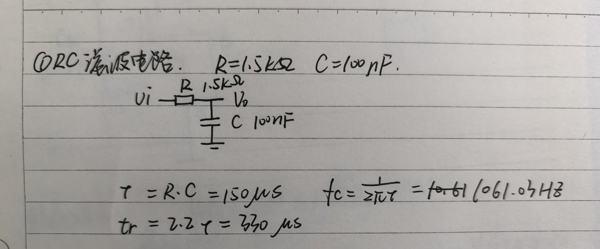

### 理论计算

**电路参数**：R = 1.5 kΩ，C = 100 nF

**时间常数**：

```
τ = R · C = 1500 Ω × 100×10⁻⁹ F = 1.5×10⁻⁴ s = 150 μs
```

**截止频率**（增益下降 3 dB、相位滞后 45° 的频率）：

```
fc = 1 / (2πRC) = 1 / (2π × 1500 × 100×10⁻⁹) = 1061.03 Hz

亦可由时间常数直接得到（两者相差 2π 倍）：
fc = 1 / (2πτ) = 1 / (2π × 150×10⁻⁶ s) = 1061.03 Hz
```

**上升时间**（10% → 90%，一阶系统的固有关系）：

```
tr = 2.2 τ = 2.2 × 150 μs = 330 μs
```

**τ 时刻的电压**（阶跃响应 `v_o(t) = V(1 − e^(−t/τ))`）：

```
t = τ 时，v_o = V(1 − e⁻¹) = 0.632 V    （输入 1 V 时）
```

### 方波输入的瞬态响应

输入 1 V / 500 Hz 方波（周期 2 ms，与 τ 同量级，可完整观察到充放电过程）：

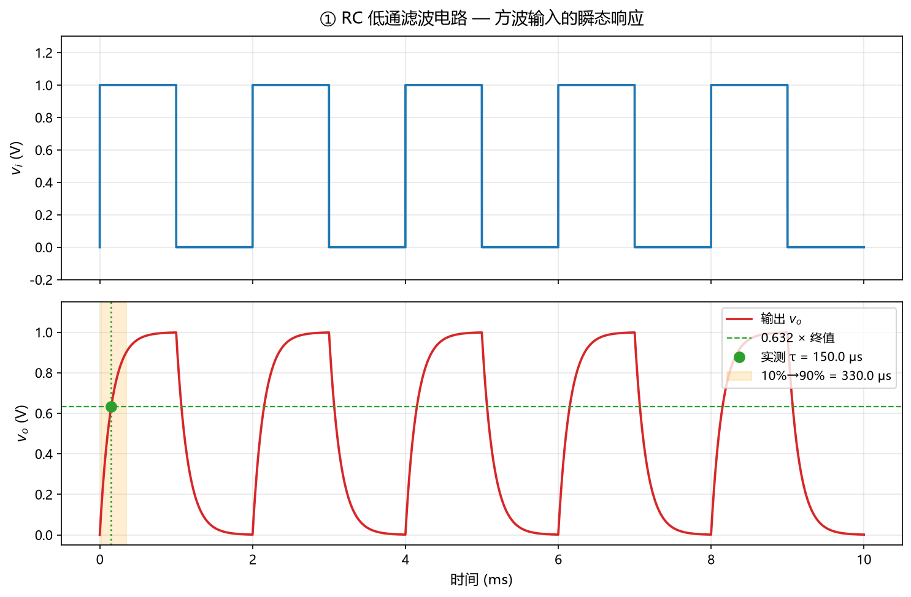

从第一个上升沿测量：

- **τ 的测量点**：输出达到终值 63.2% 的时刻
- **10%→90% 上升时间**：图中橙色阴影区

### 波特图（AC 扫频）

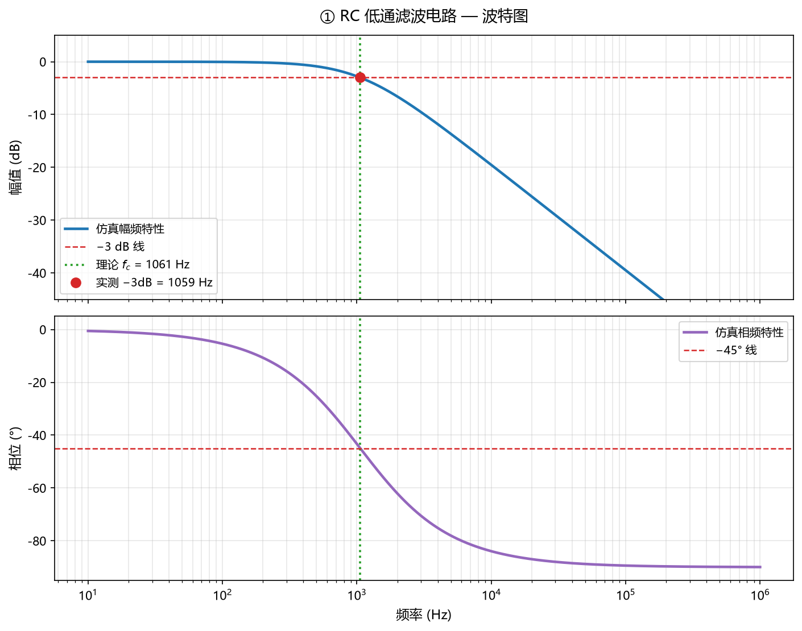

### 理论值 vs 仿真值

| 项目 | 理论值 | 仿真值 | 相对误差 |
| --- | --- | --- | --- |
| 时间常数 τ（0.632 法） | 150.000 μs | **150.050 μs** | 0.03 % |
| 时间常数 τ（10–90% 法） | 150.000 μs | **150.205 μs** | 0.14 % |
| 上升时间 tr = 2.2τ | 330.000 μs | **330.000 μs** | 0.00 % |
| 截止频率 fc | 1061.03 Hz | **1059.25 Hz** | 0.17 % |
| fc 处幅值 | −3.00 dB | **−3.00 dB** | 0.10 % |
| fc 处相位 | −45.00° | **−44.95°** | 0.11 % |

### 结论

仿真得到的瞬态响应与频率特性完全符合一阶 RC 低通滤波器的理论：

1. **时间常数**：用「输出达到终值 63.2%」测得的 τ = 150.05 μs，与理论值 150 μs 相差仅 0.03%；用「10%→90% 上升时间 / 2.197」反推的 τ = 150.21 μs，误差 0.14%。
2. **截止频率**：实测 −3 dB 点 1059.25 Hz，与理论 1061.03 Hz 相差 0.17%。该误差来自扫频点在对数轴上的离散间隔（200 点/十倍频程），属于采样精度范畴，不是模型误差。
3. **高频滚降**：约 −20 dB/十倍频程，与理论一致。
4. 方波输入下可以清楚看到电容的充放电过程：方波频率（500 Hz）与截止频率（1061 Hz）同量级，因此输出呈现明显的指数上升/下降，而不是完整的方波。

---

## ② 验证戴维南定理

### 含源二端网络图

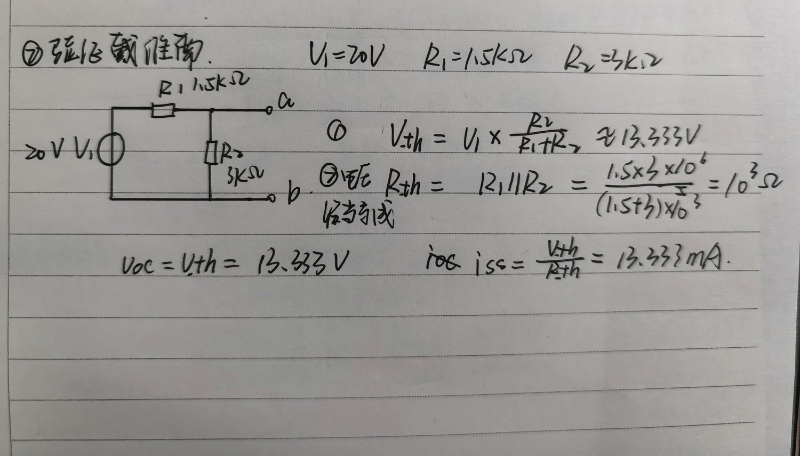

**端口定义**：a 为输出端（分压节点），b 为参考地。

### 理论计算

**电路参数**：V₁ = 20 V，R₁ = 1.5 kΩ，R₂ = 3 kΩ

**戴维南等效电压 V_th**（端口开路时的电压，即 R₁、R₂ 的分压）：

```
V_th = V₁ · R₂/(R₁ + R₂) = 20 × 3/(1.5 + 3) = 13.3333 V
```

**戴维南等效电阻 R_th**（两个独立源置零后，从端口 a、b 看进去的等效电阻）：

```
R_th = R₁ ∥ R₂ = (R₁·R₂)/(R₁ + R₂) = (1.5 × 3)/(1.5 + 3) = 1.0000 kΩ
```

**短路电流 I_sc**：

```
I_sc = V_th / R_th = 13.3333 / 1 kΩ = 13.3333 mA
```

### 戴维南等效电路

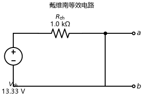

### 理论与仿真对比（V_oc 与 I_sc 两次仿真）

| 项目 | 理论值 | 仿真值 | 相对误差 |
| --- | --- | --- | --- |
| 开路电压 V_oc | 13.3333 V | **13.3333 V** | 0.0001 % |
| 短路电流 I_sc | 13.3333 mA | **13.3333 mA** | 0.0000 % |
| R_th = V_oc / I_sc | 1000.000 Ω | **999.999 Ω** | 0.0001 % |

> **仿真方法**：V_oc 用输出端接 1 GΩ 近似开路测得；I_sc 用输出端串入 0 V 理想电压源作电流探针测得（读数取自 `branches['vsense']`）。

### 等效替换后接负载的电压 / 电流验证

| R_L (kΩ) | V_L 原电路 (V) | V_L 等效电路 (V) | I_L 原电路 (mA) | I_L 等效电路 (mA) | V 误差 | I 误差 |
| --- | --- | --- | --- | --- | --- | --- |
| 0.5 | 4.444444 | 4.444444 | 8.888889 | 8.888889 | 2.0×10⁻¹⁴ % | 2.0×10⁻¹⁴ % |
| 1.0 | 6.666667 | 6.666667 | 6.666667 | 6.666667 | 2.7×10⁻¹⁴ % | 2.7×10⁻¹⁴ % |
| 1.2 | 7.272727 | 7.272727 | 6.060606 | 6.060606 | 2.4×10⁻¹⁴ % | 2.9×10⁻¹⁴ % |
| 2.0 | 8.888889 | 8.888889 | 4.444444 | 4.444444 | 2.0×10⁻¹⁴ % | 2.0×10⁻¹⁴ % |
| 3.0 | 10.000000 | 10.000000 | 3.333333 | 3.333333 | 1.8×10⁻¹⁴ % | 1.3×10⁻¹⁴ % |
| 5.0 | 11.111111 | 11.111111 | 2.222222 | 2.222222 | 3.2×10⁻¹⁴ % | 4.0×10⁻¹⁴ % |
| 10.0 | 12.121212 | 12.121212 | 1.212121 | 1.212121 | 0 | 0 |
| 20.0 | 12.698413 | 12.698413 | 0.634921 | 0.634921 | 2.8×10⁻¹⁴ % | 1.8×10⁻¹⁴ % |

**电压最大相对误差 3.2×10⁻¹⁴ %，电流最大相对误差 4.0×10⁻¹⁴ %。**

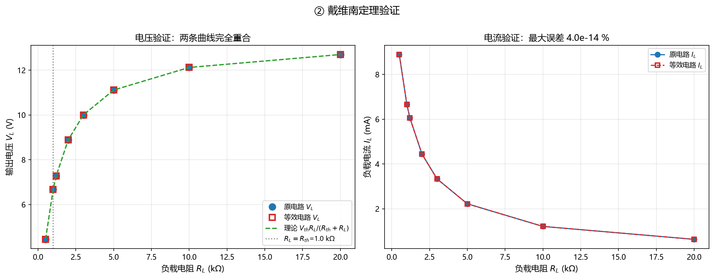

### 由仿真数据反推 R_th

原理：`V_L = V_th·R_L/(R_th + R_L)` ⟹ `R_th = R_L·(V_th − V_L)/V_L`

用上表 8 组数据分别反推，结果**全部为 1000.00 Ω**：

| 项目 | 数值 |
| --- | --- |
| 反推 R_th 平均值 | 1000.00 Ω（1.0000 kΩ） |
| 理论 R_th | 1000.00 Ω（1.0000 kΩ） |
| 相对误差 | **0.0000 %** |

### 结论

1. 原电路的开路电压等于理论戴维南电压 V_th = 13.3333 V，误差 0.0001%；短路电流等于理论 I_sc = 13.3333 mA，误差 0.0000%。
2. 在 0.5 kΩ ～ 20 kΩ 共 8 种负载下，**原电路与戴维南等效电路的输出电压、输出电流完全相同**，最大相对误差 4.0×10⁻¹⁴ %（已是双精度浮点数的舍入误差量级）。
3. 这直接验证了戴维南定理：**任何含源线性二端网络，对外电路而言都可以等效为一个电压源 V_th 串联一个电阻 R_th**。
4. 由仿真数据反推的 R_th 与理论值完全一致（误差 0%），进一步印证了等效电阻计算的正确性。

---

## ③ NMOS 共源级放大电路

### 电路图（题卡给定）

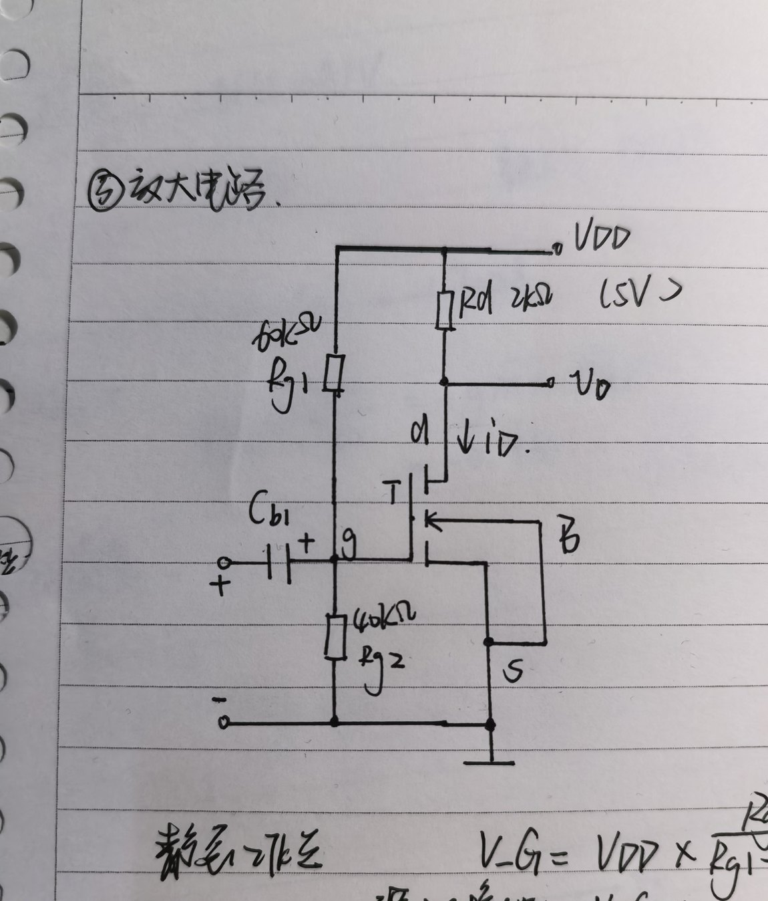

### 器件与电路参数

| 参数 | 数值 |
| --- | --- |
| V_DD | 5 V |
| R_g1 / R_g2 | 60 kΩ / 40 kΩ |
| R_d | 2 kΩ |
| C_b1 | 10 µF（足够大） |
| NMOS K | 0.8 mA/V² |
| NMOS V_th | 1 V |
| NMOS λ | 0.02 /V |
| 输入 v_i | 10 mV / 1 kHz 正弦波 |

> **电流公式约定**：本报告采用 `I_D = ½·K·V_ov²`（即 K = µnCox·W/L）。SPICE 建模时按 Level 1 模型设置 `KP = 0.8 mA/V²`、`W/L = 1`，使仿真与手算使用同一定义。

### 一、手算静态工作点（Q 点）

**1. 栅极电压**（MOS 栅极电流为零，Rg1、Rg2 纯分压）：

```
V_G = V_DD × Rg2/(Rg1 + Rg2) = 5 × 40/(60 + 40) = 2.0000 V
```

**2. 栅源电压与过驱动电压**（源极直接接地，V_S = 0）：

```
V_GS = V_G − V_S = 2.0000 V
V_ov = V_GS − V_th = 2 − 1 = 1.0000 V
```

**3. 漏极电流**（先按饱和区公式）：

```
I_D = ½ · K · V_ov² = 0.5 × 0.8 mA/V² × (1 V)² = 0.4000 mA
```

**4. 漏源电压**：

```
V_DS = V_DD − I_D · R_d = 5 − 0.4 mA × 2 kΩ = 4.2000 V
```

**5. 饱和区判据**：

```
V_DS > V_GS − V_th   →   4.2000 V > 1.0000 V   ✅
```

> **结论：工作在饱和区（恒流区）**，且 V_DS 距饱和边界有 3.2 V 余量，工作点稳定。

**6. 计入沟道长度调制（λ = 0.02 /V）的精确解**

`I_D = ½K·V_ov²(1 + λV_DS)` 与 `V_DS = V_DD − I_D·R_d` 相互制约，迭代求解：

| 迭代 | 代入 V_DS | 算得 I_D | 回代 V_DS |
| --- | --- | --- | --- |
| 0 | 4.2000 V | 0.4336 mA | 4.1330 V |
| 1 | 4.1330 V | 0.4331 mA | 4.1339 V |
| 2 | 4.1339 V | **0.4331 mA** | **4.1339 V** |

#### 关于 λ 的处理说明

本小题**同时给出了两种算法的结果**，原因如下：

| 算法 | 公式 | I_D | V_DS | 用途 |
| --- | --- | --- | --- | --- |
| 简化估算 | `I_D = ½K·V_ov²` | 0.4000 mA | 4.2000 V | 快速定性判断 |
| 精确解 | `I_D = ½K·V_ov²(1 + λV_DS)` | **0.4331 mA** | **4.1339 V** | 与仿真对比 |

**① 两者的饱和区判断结论一致**（都满足 V_DS > V_ov），说明用简化公式做定性判断是可靠的。

**② 但后续的「手算 vs 仿真」对比表采用精确解**，原因有两点：

1. SPICE 的 Level 1 模型里 `LAMBDA` 参数**默认生效**，仿真得到的 I_D、V_DS 本身就是含 λ 的结果；
2. 若用简化估算值去对比，I_D 会出现 **7.6 %** 的偏差（0.4000 vs 0.433071 mA），容易被误认为仿真出错。

**③ 精确解其实不必迭代** —— 把 `V_DS = V_DD − I_D·R_d` 代入电流公式，对 I_D 是一元一次方程，可直接解出：

```
          ½K·V_ov²·(1 + λ·V_DD)
I_D = ─────────────────────────────
          1 + ½K·V_ov²·λ·R_d

        0.4 mA × (1 + 0.02 × 5)        0.44 mA
    = ──────────────────────────  =  ──────────  = 0.4331 mA
        1 + 0.4 mA × 0.02 × 2 kΩ         1.016
```

回代得 `V_DS = 5 − 0.4331 × 2 = 4.1339 V`。

> 上文的迭代表只是把这个解析解一步步逼近给你看，最终结果与解析解完全一致。
### 二、手算小信号参数

**1. 跨导 g_m**：

```
忽略 λ：  g_m = K · V_ov     = 0.8 × 1    = 0.8000 mA/V
计入 λ：  g_m = 2·I_D / V_ov = 2×0.4331/1 = 0.8661 mA/V
```

**2. 输出电阻 r_o**：

```
r_o = 1/(λ · I_D) = 1/(0.02 × 0.4331 mA) = 115.45 kΩ
```

**3. 电压增益 A_v**：

```
A_v = −g_m · (R_d ∥ r_o)

忽略 r_o：  A_v = −0.8000 mA/V × 2 kΩ                = −1.6000
计入 r_o：  R_d∥r_o = (2×115.45)/(2+115.45) = 1.9660 kΩ
            A_v = −0.8661 mA/V × 1.9660 kΩ           = −1.7028
```

负号表示**输出与输入反相 180°**，这是共源放大器的固有特征。

### 三、直流通路图

电容 C_b1 对直流相当于开路，输入信号源置零，得到直流通路：

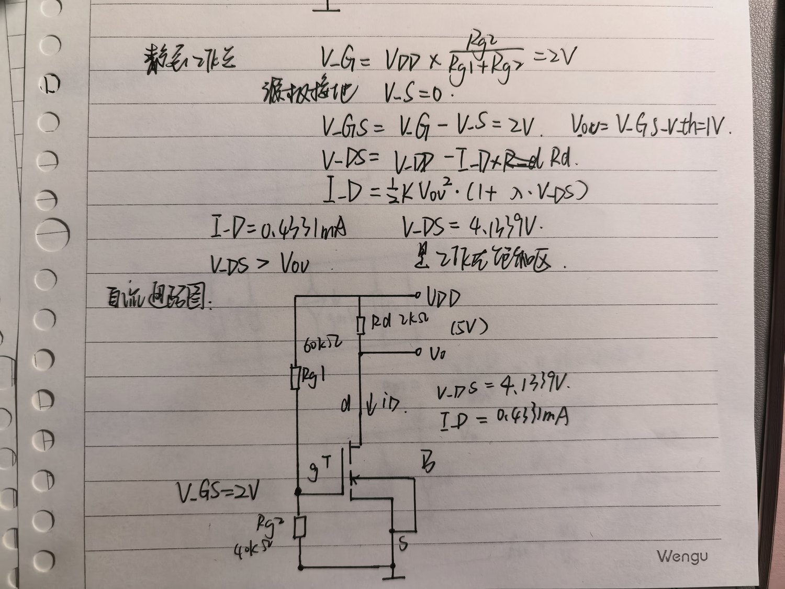

**分析要点**：栅极电流为零 → Rg1、Rg2 纯分压 → V_G = 2 V → V_GS = 2 V → 由饱和区方程求出 I_D = 0.433 mA → 再由 R_d 上的压降确定 V_DS = 4.13 V。

### 四、小信号等效模型

将 NMOS 用其低频小信号模型替换，直流电源 V_DD 交流接地，耦合电容 C_b1 视为短路：

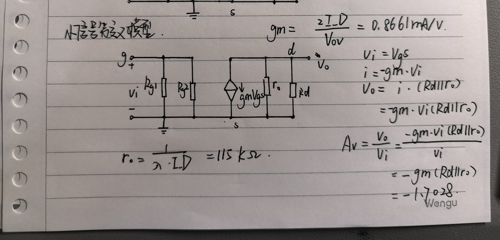

| 元件 | 说明 |
| --- | --- |
| v_i | 输入信号，直接加在栅源之间（源极交流接地，故 v_gs = v_i） |
| R_g1 ∥ R_g2 | 偏置电阻网络，交流中并联接地，= 24 kΩ |
| g_m·v_gs | 压控电流源，方向由漏极流向源极 |
| r_o | 沟道长度调制引起的输出电阻，与 R_d 并联 |
| R_d | 因 V_DD 交流接地，R_d 下端接地，成为交流负载 |

**增益推导**：

```
A_v = v_o/v_i = −g_m·v_gs·(R_d ∥ r_o) / v_gs = −g_m·(R_d ∥ r_o)
```

### 五、仿真验证

**1. 静态工作点对比**

| 项目 | 手算值 | 仿真值 | 相对误差 |
| --- | --- | --- | --- |
| V_G | 2.0000 V | **2.000000 V** | 0.0000 % |
| V_GS | 2.0000 V | **2.000000 V** | 0.0000 % |
| V_DS | 4.1339 V | **4.133858 V** | 0.0000 % |
| I_D | 0.4331 mA | **0.433071 mA** | 0.0000 % |
| 饱和区判断 | V_DS(4.13 V) > V_ov(1.00 V) | ✅ **工作在饱和区** | — |

**2. 跨导 g_m 对比**

仿真方法：栅极加理想电压源、漏源之间也加理想电压源（把 V_DS 钉在 Q 点值 4.1339 V），在 Q 点两侧各取一点，用两点差分 `g_m = ΔI_D/ΔV_GS` 求跨导。

| 项目 | 手算值 | 仿真值 | 相对误差 |
| --- | --- | --- | --- |
| 跨导 g_m | 0.8661 mA/V | **0.8661 mA/V** | **0.00 %** |
| 输出电阻 r_o | 115.45 kΩ | 由 λ 与 I_D 确定 | — |

> **测量要点**：V_DS 必须固定，否则测到的是「沿负载线的斜率」而非 g_m。若用固定 R_d 的电路直接测，得到的是 `g_m/(1 + R_d/r_o) = 0.8513 mA/V`（与 g_m 相差 1.7%），二者不可混用。

**3. 增益与波形**

| 项目 | 手算值 | 仿真值 | 相对误差 |
| --- | --- | --- | --- |
| 电压增益 \|A_v\|（计入 r_o） | 1.7028 | **1.7050** | **0.13 %** |
| 电压增益 \|A_v\|（忽略 r_o） | 1.6000 | — | （偏差 6.2%） |
| 输出相位 | −180° | **−180.0°** | ✅ 反相 |
| 输出幅度 | 17.03 mV | **17.05 mV** | 0.13 % |

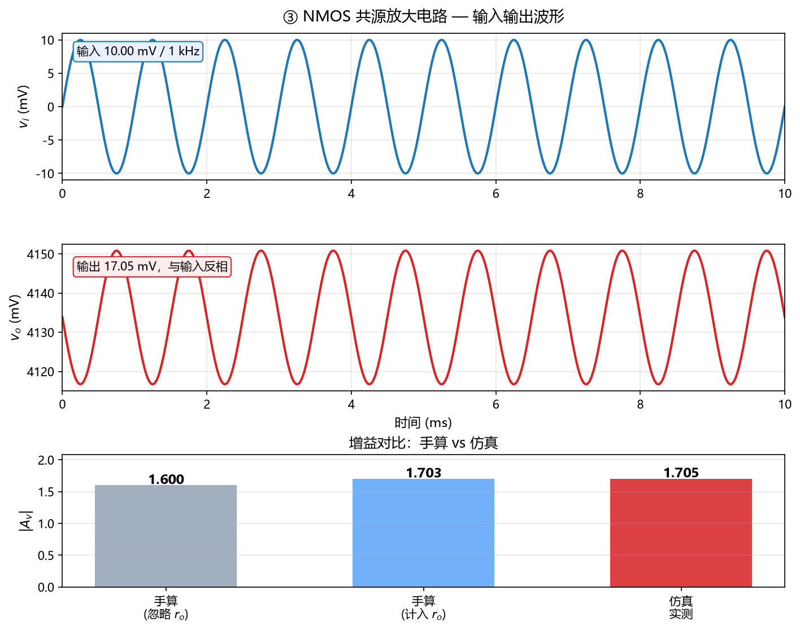

从波形可以清楚看到：**输出与输入严格反相**（输入峰值对应输出谷值），这就是共源放大器的反相放大特征。

**4. 静态工作点在转移特性上的位置**

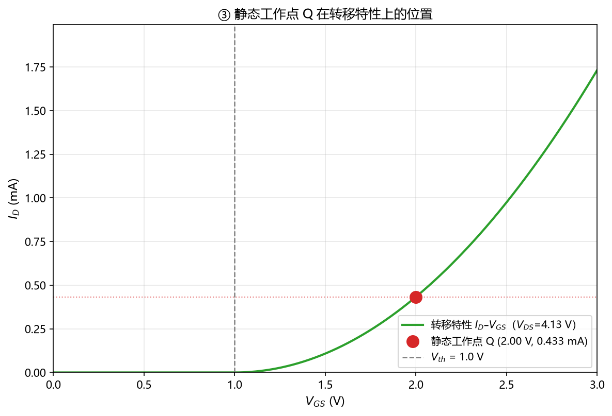

### 结论

1. **静态工作点**：V_GS = 2 V，I_D ≈ 0.433 mA，V_DS ≈ 4.134 V，**工作在饱和区**。仿真与手算误差为 **0.0000%**，说明所用的 Level 1 模型参数与手算公式完全对应。
2. **小信号参数**：g_m = 0.8661 mA/V（仿真与手算误差 **0.00%**），r_o = 115.45 kΩ。
3. **电压增益**：手算（计入 r_o）A_v = **−1.7028**，仿真实测 |A_v| = **1.7050**，误差仅 **0.13%**；仿真同时给出相位 −180.0°，与理论的反相结论一致。
4. **关于 r_o 的影响**：忽略 r_o 时 A_v = −1.6，与实测 1.705 相差 6.2%；计入 r_o 后误差降到 0.13%。说明 λ = 0.02 /V 虽然很小，但在精确分析时应当计入。
5. **耦合电容的影响**：C_b1 取 10 µF，与栅极偏置网络等效电阻 24 kΩ 构成的高通转折频率约 0.66 Hz，远低于工作频率 1 kHz，因此在工作频段内 C_b1 可视为短路，不影响增益测量。

---

## 三个电路结论汇总

| 电路 | 核心结论 |
| --- | --- |
| ① RC 低通滤波 | τ 实测 150.05 μs vs 理论 150 μs（误差 0.03%）；fc 实测 1059.25 Hz vs 理论 1061.03 Hz（误差 0.17%）；高频斜率约 −20 dB/dec |
| ② 戴维南定理 | V_oc、I_sc 仿真误差 ≤ 0.0001%；8 种负载下原电路与等效电路的电压/电流完全一致（误差 4.0×10⁻¹⁴ %）；反推 R_th 误差 0% |
| ③ NMOS 共源放大 | Q 点误差 0.0000%；g_m 误差 0.00%；实测增益 1.7050 vs 手算 1.7028（误差 0.13%）；输出相位 −180°，反相正确 |

---

## 为什么选择 MIT License

本项目采用 **MIT License**，主要基于以下五点考虑。

### 1. 最宽松，符合"分享"的初衷

个人主页本身不涉及商业机密，我做它的目的一方面是展示自己，另一方面也是给别人做个参考。MIT 协议允许任何人自由地使用、复制、修改、合并、发布、分发、再授权甚至销售本软件，**把别人使用它的门槛降到了最低**，这与我"希望被看到、被参考"的初衷是一致的。

### 2. 条款简洁，双方的理解成本都最低

MIT 全文只有一段话，核心内容就两条：

> 你可以随便用，但要保留我的版权声明；软件出问题我不负责。

相比之下，Apache 2.0 包含专利授权、商标使用、贡献者许可等大量条款，GPL 则有整章的传染性约束。对一个个人主页来说，那些条款既不必要，也增加了使用者的阅读负担。

### 3. 没有"传染性"，兼容性好

GPL 类协议要求衍生作品也必须以 GPL 开源。而个人主页的样式和布局恰恰是经常被别人拿去做模板的部分，如果采用 GPL，会给使用者带来不必要的法律约束。

MIT 不存在这个问题，并且与绝大多数其他开源协议兼容，代码可以放心地被合并进别的项目。

### 4. 保留署名权，兼顾作者权益

MIT 唯一的实质性要求是：**在软件的所有副本或实质性部分中，必须保留版权声明和许可声明**。

也就是说，别人可以自由使用，但不能抹掉"这是刘诗涵写的"这个事实 —— 在"方便他人"和"保护自己"之间取得了平衡。

### 5. 生态最主流，沟通成本最低

MIT 是 GitHub 上使用最广泛的开源协议。选择一个主流协议，可以让引用者不必反复确认授权范围，减少了不必要的沟通。

### 为什么没有选择其他协议

| 协议 | 不考虑的原因 |
| --- | --- |
| **Apache 2.0** | 功能上比 MIT 更完备（尤其是专利授权条款），但对一个个人主页而言条款过重，没有必要 |
| **GPL v3** | 具有"传染性"，会限制他人将其用于自己的项目，与本项目希望被自由参考的定位不符 |
| **CC0 / Unlicense** | 放弃全部权利、进入公共领域，无法保留作者署名 |
| **未声明许可证** | 默认保留所有权利，别人即使想参考也不敢用，与开源分享的目的相反 |

### 结论

**MIT 是在「方便他人自由使用」与「保留作者署名」之间最平衡的选择** —— 它足够宽松，不给人添麻烦；又足够清晰，保住了最基本的署名权。

---

## AI 提示词记录：贪吃蛇小游戏

主页里的贪吃蛇小游戏，是一次完整的「与 AI 协作开发」过程。下面按**每一轮迭代**记录四件事：**想让 AI 做什么**、**结果如何**、**提示词怎么调整**，以及**每一轮是怎么实现、怎么验证的**。

> **为什么记录这个**：AI 写代码很快，但「它说能跑」和「它真的能跑」是两回事。
> 四轮迭代下来最深的体会是 —— **提示词写得越可量化，验证就越有力**。

### 记录方式说明

| 记录项 | 记录什么 |
| --- | --- |
| 📝 提示词原文 | 我给 AI 的原话，一字不改 |
| 🎯 想让 AI 做什么 | 我提这条需求时的真实意图 |
| 📦 结果如何 | AI 实际做出来了什么，是否达到预期 |
| 🔄 提示词怎么调整 | 对照上一轮的结果，下一条提示词改了什么、为什么改 |
| 🔧 怎么实现的 | AI 采用的技术方案 |
| ✅ 怎么验证的 | 我用的验证方法，以及验证结果 |

---

## 迭代一：做一个「能自己玩」的贪吃蛇

### 📝 提示词原文

> 制作一个贪吃蛇的游戏，"能自己玩"的版本，即用户我本身自己玩的，人为操作，且规则完整，有得分，胜负或通关的判定，界面上能看到当前得分的状态，界面干净明了，玩家一看就知道如何玩，并且知道自己玩到哪一步了；

### 🎯 想让 AI 做什么

我说得很明确：「能自己玩」指的是**我自己本人玩、人为操作**，不是让游戏替我玩。

其余要求逐条拆开：

| 提示词里的说法 | 我真正想要的东西 |
| --- | --- |
| "能自己玩"的版本，即用户我本身自己玩的，人为操作 | 玩家用键盘／手指操控蛇，AI 不要插手 |
| 规则完整 | 吃食物加分、撞墙或咬到自己结束、达到目标分数通关 |
| 胜负或通关的判定 | 要有明确的结局，不能一直玩下去没有结果 |
| 能看到当前得分的状态 | 得分数字要一直显示在界面上 |
| 玩家一看就知道如何玩 | 操作方式要一眼看懂，不用去翻说明 |
| 知道自己玩到哪一步了 | 要有进度条，显示距离通关还差多少 |
| 界面干净明了 | 一屏看完，不滚动就知道怎么玩 |

### 📦 结果如何

**AI 交出来的东西**：一个 `snake.html`，单文件（约 21 KB）、零依赖、双击就能打开。

| 交付内容 | 说明 |
| --- | --- |
| 完整规则 | +10 分 / 撞墙结束 / 咬自己结束 / 200 分通关 / 填满棋盘完美通关 |
| **手动操作** | 方向键、WASD、手机滑动 —— 这是我要的核心功能 |
| 状态显示 | 本局得分、蛇长、最高分、进度条 |
| 交互提示 | 遮罩层显示当前状态和下一步该做什么 |
| （额外）AI 自动玩 | AI 顺手多做了一套自动寻路，**这一轮我并没有要求**；不过它正好为下一轮迭代省了事 |

**验证结果**（5 项全部通过）：AI 自动玩跑了一局，**得分 200，通关**，蛇长 23。

**但结果里藏着一个隐患**：AI 只跑了**一局**就宣布完成了。单局通关说明不了稳定性 —— 食物是随机生成的，那一局可能只是运气好。

### 🔄 提示词怎么调整

这是第一条提示词，没有上一轮可以对照。但**看到结果之后**，我发现了这条提示词的不足：

- 我写的是「规则完整」「界面干净明了」「一看就知道怎么玩」—— 这些全是**主观描述**，AI 说做到了，我很难反驳；
- 我也没规定**验证要做到什么程度**，所以 AI 跑了一局就收工了。

**这就决定了下一轮提示词必须改的地方：把要求从「主观描述」换成「可量化的数字」，并且明确要求「全程无需人工操作」。**

### 🔧 阶段一是怎么实现的

**技术选型**：单个 HTML 文件 + Canvas 绘制，不引入任何框架。

**手动操作**（这是这一轮的核心）：方向键 / WASD 控制，空格暂停，R 重开，手机上滑动转向，并且禁止 180° 掉头。

**规则与状态**：吃食物 +10 分，撞墙或咬到自己结束，200 分通关；面板实时显示本局得分、蛇长、最高分，进度条显示距离通关还差多少。

**界面顺序**：标题 → 数据面板 → 进度条 → 棋盘 → 按钮 → 规则说明，一屏看完。

**（额外）AI 自动寻路的决策逻辑**，分成四层：

1. 先排除「掉头 / 撞墙 / 直接咬到自己」的方向
2. 在剩下的方向里，只保留「走完这一步还能追到自己尾巴」的安全方向（用 BFS 判断可达性）
3. 在安全方向里挑离食物最近的（再用一次 BFS 算距离）
4. 如果所有方向都到不了食物，就先去追自己的尾巴，争取活动空间

### ✅ 阶段一是怎么验证的

AI 说「做好了」，但光看代码不能确认它真能跑。所以我要求它做**真正的运行测试**。

**验证方法：用 Node.js + DOM 桩，把游戏的真实代码跑起来。**

具体做法是把 `document`、`canvas`、`localStorage`、`requestAnimationFrame` 全部用桩模拟出来，然后把 `snake.html` 里的 JS 代码原样加载进去，手动推进帧、观察状态变化。这样不用打开浏览器，就能确认逻辑确实在按预期运行 —— 而且用的是**真代码**，不是重新写一遍。

| 测试项 | 结果 |
| --- | --- |
| 手动模式不转向 | ✅ 正确判定「撞到墙了」 |
| 键盘 ↑ 转向 | ✅ 生效 |
| 空格暂停 | ✅ 显示遮罩，按钮变「继续」 |
| 进度条 | ✅ 随得分增长 |
| （额外）AI 自动玩 20 万帧不干预 | ✅ 得分 200，**通关**，蛇长 23 |

> ⚠️ **这一轮的验证是不充分的**：样本只有 1 局。这正是下一轮要解决的问题。

---

## 迭代二：加入 AI 自动操作 + 统计系统

### 📝 提示词原文

> 在阶段一基础上，加入AI自动操作，即AI自己玩，AI玩的时候，能够做到AI能自动控制蛇连续吃完15个食物不死，即不撞墙也不撞自己，且全程无需人工操作，除此外新增功能计分制，包括做到记录得分，最高分和局数，新一局不清零，有重置的按钮

### 🎯 想让 AI 做什么

这一轮是在**阶段一（手动操作版）的基础上加东西**，分成两半：

**前半段 —— 加入 AI 自动操作**：

- 「在阶段一基础上，加入 AI 自动操作，即 AI 自己玩」→ 上一轮 AI 顺手做的自动寻路，这一轮我把它**正式列为需求**；
- 「连续吃完 **15 个**食物不死」→ 给出一个**具体的数字**，它可以直接变成自动化测试的断言；
- 「不撞墙也不撞自己」→ 明确了失败的两种形式；
- 「全程无需人工操作」→ 明确要求 AI 独立跑完全程，中途不许人插手救场。

**后半段 —— 新增统计系统**：

- 记录得分、最高分、局数；
- **新一局不清零**（这是关键，成绩要能累积）；
- 配一个重置按钮。

### 📦 结果如何

**第一步就暴露了问题。** AI 没有直接改代码，而是先把「AI 自动玩」连跑 **30 局**做统计：

| 指标 | 30 局实测 |
| --- | --- |
| 吃到 ≥15 个食物 | 30/30 |
| 成功通关 | 29/30 |
| **卡住绕圈** | **1 次** ← 缺陷 |

那 1 局里，蛇吃到 16 个食物后**陷入了无限绕圈**：AI 判断「现在去吃食物不安全」，于是一直追自己的尾巴，既不去吃，也不会死，就那样卡住了。

**这个缺陷，上一轮的单局测试永远碰不到。**

**第二步：修复。** 加了一个**「饥饿计数器」**：

- 记录 AI 距离上次吃到食物走了多少步；
- 一旦连续 **80 步**没吃到，就切换成**激进模式** —— 只要下一步不会立刻死，就直奔食物，不再保守绕圈。

**第三步：实现统计系统。**

- 用 `localStorage` 持久化四项数据：**累计局数 / 最高分 / 累计总分 / 累计食物数**；
- 引入「一局」的概念：从开始运行到结束（通关或失败）算一局，结束时结算一次；
- 关键设计：结算函数**一场只调用一次**；中途点「重新开始」也会先把当前这局结算掉，避免漏记或重复计数；
- 新增「重置统计」按钮，点击时**先弹确认框**，把即将清空的数据列出来，防止误触。

**最终结果**：

| 指标 | 修复前 | 修复后 |
| --- | --- | --- |
| 吃到 ≥15 个食物 | 30/30 | **30/30** |
| 卡住绕圈 | 1 次 | **0 次** |
| 成功通关 | 29/30 | **30/30** |
| 平均每局 | 19.9 个 | **20.0 个** |

### 🔄 提示词怎么调整

对照迭代一，这一轮的提示词改了**三处**，每一处都是被上一轮的结果逼出来的：

| 改了什么 | 迭代一的写法 | 迭代二的写法 | 为什么这么改 |
| --- | --- | --- | --- |
| **玩法** | 「即用户我本身自己玩的，**人为操作**」 | 「在阶段一基础上，**加入 AI 自动操作**，即 AI 自己玩」 | 上一轮 AI 顺手做的自动寻路，这一轮我把它**正式列为需求**，并明确要求 AI 能独立完成 |
| **验收标准** | 「规则完整」「界面干净明了」（主观描述，没法验收） | 「**连续吃完 15 个食物不死**」（可量化） | 主观描述 AI 说做到了我也没法反驳；换成数字之后，可以直接变成自动化测试的断言 |
| **操作要求** | 人为操作 | 「**全程无需人工操作**」 | 明确要求 AI 独立跑完全程，中途不许人插手救场 |
| **新增需求** | — | 计分制：得分 / 最高分 / 局数，新局不清零，加重置按钮 | 游戏能玩了，下一步要能**累计成绩**，所以把统计和重置的规则一次说清 |

**这次调整的效果是立竿见影的**：正因为提示词里写了「连续 15 个」这个数字，AI 才会去跑 30 局压力测试 —— 然后才发现了那个单局测不出来的卡死缺陷。

> **经验：一个好的提示词，应该让「做没做到」可以被机械地判定。**
> 「界面干净明了」做不到这一点，「连续吃完 15 个食物不死」可以。

### 🔧 阶段二是怎么实现的

**（1）缺陷修复 —— 饥饿计数器**

在 AI 的决策流程最前面插入一个判断：如果距离上次吃到食物已经走了 80 步以上，就跳过「安全方向筛选」，直接在不会立刻死亡的方向里选离食物最近的。这样既不会把自己困死，也不会永远绕圈不去吃。

**（2）统计系统 —— 跨局累积**

| 设计点 | 做法 |
| --- | --- |
| 存哪里 | `localStorage`，键名固定，刷新和关闭页面都不丢 |
| 存什么 | 累计局数、最高分、累计总分、累计食物数 |
| 什么时候记 | 一局**结束**时结算；中途「重新开始」也先结算当前这局 |
| 怎么防重复 | 用一个 `roundActive` 标志，保证一场只结算一次 |
| 怎么清零 | 独立的「重置统计」按钮，点击时先弹确认框并列出将清空的数据 |
| 怎么区分 | 主面板显示「本局得分」（绿色高亮），历史数据单独显示，新一局只清本局 |

### ✅ 阶段二是怎么验证的

仍然用 Node + DOM 桩跑真代码，但这轮的测试分成两部分。

**测试 A：AI 稳定性（连续 30 局）**

| 指标 | 修复前 | 修复后 |
| --- | --- | --- |
| 吃到 ≥15 个食物 | 30/30 | **30/30** |
| 卡住绕圈 | 1 次 | **0 次** |
| 成功通关 | 29/30 | **30/30** |

**测试 B：统计系统**

```
✅ 初始统计全为 0
✅ 累计局数 = 3
✅ 累计总分 = 600
✅ 最高分   = 200
✅ 累计食物 = 60
✅ 点「重新开始」后统计未清零（局数 3 / 总分 600）   ← 提示词里的关键需求
✅ 但本局得分已归零（0）
✅ 再玩一局，局数累加到 4，总分累加到 800
✅ 点「重置统计」，全部归零
```

> **这一轮验证的价值**：如果不跑 30 局，那个「无限绕圈」的缺陷根本不会暴露。
> 而之所以会去跑 30 局，是因为**提示词里写了「连续 15 个」这个可量化的数字**。

---

## 迭代三：加上「最近 10 局战绩」列表

### 📝 提示词原文

> 贪吃蛇游戏再新增一个功能，多局战绩即记录最近10局的结果，新一局可自动追加并且可以看完整的列表

### 🎯 想让 AI 做什么

前两轮已经解决了「怎么玩」和「AI 怎么自己玩」，也做了累计统计。但那些都是**汇总数字** —— 能看出总量，看不出**趋势**（最近几局是越打越好，还是在退步）。

所以这一轮是补一块**可追溯的明细**：

| 提示词里的说法 | 我想解决的问题 |
| --- | --- |
| 记录最近 **10 局**的结果 | 每一局分别得了多少分，而不只是"一共玩了多少局" |
| 新一局**可自动追加** | 不用手动保存，一局结束自己记进去 |
| **可以看完整的列表** | 有个地方能把这 10 局完整列出来对比 |

### 📦 结果如何

这一轮一次就做对了，新增了这些：

| 交付内容 | 说明 |
| --- | --- |
| 可折叠的「📋 最近战绩」面板 | 默认收起不占地方；标题上直接显示当前有几局 |
| 战绩表格 | 5 列：**局号 / 得分 / 结果 / 蛇长 / 用时** |
| 自动追加 | 每局结算时自动插到列表**最前面**（最新的在最上） |
| 只留 10 局 | 超过 10 局自动挤掉最旧的 |
| 跨刷新保留 | 和累计统计一起存进 `localStorage`，关掉浏览器也不丢 |

**结果分三种显示**：`通关 ✓`（绿色）／`结束`（红色）／`中途重开`（灰色）。

### 🔄 提示词怎么调整

这次提示词一句话就把三个关键点说全了，所以基本没有返工：

| 提示词里的说法 | 直接对应到的实现 |
| --- | --- |
| 记录最近 **10 局**的结果 | 明确上限 → `HISTORY_MAX = 10` |
| 新一局**可自动追加** | 挂在原有的结算函数 `endRound()` 里，一局结束就写 |
| **可以看完整的列表** | 做一个可折叠的表格面板 |

**设计取舍**：做成**可折叠面板**（默认收起）而不是每局结束弹窗 —— 弹窗会打断游戏节奏，而且迭代一就明确要求过「界面干净明了」。

> **经验：把"上限"和"触发时机"写清楚，比笼统地说"记录历史"有用得多。**
> 「记录最近 10 局」这一句话，同时定死了三件事 —— **存什么、存多少、什么时候存**。

### 🔧 怎么实现的

**（1）数据结构** —— 在原来的统计对象里加一个数组：

```js
let stats = { rounds: 0, best: 0, total: 0, food: 0, history: [] };
```

每条记录长这样：

```js
{ no: 13, score: 200, len: 23, result: 'win', secs: 42 }
```

**（2）自动追加** —— 复用原来的结算函数。原来的 `endRound()` 并不知道这局是赢是输，所以给它加了一个参数：

| 调用处 | 传入的结果 |
| --- | --- |
| `win()` | `'win'` |
| `lose()` | `'lose'` |
| `reset()`（中途重开） | `'abort'` |

追加逻辑就是「头插 + 截断」：

```js
function pushHistory(sc, len, result, secs) {
  stats.history.unshift({ no: stats.rounds, score: sc, len: len, result: result, secs: secs });
  if (stats.history.length > HISTORY_MAX) stats.history.length = HISTORY_MAX;
}
```

**（3）两个防坑设计**

- **中途重开且一分没得 → 不记录**。否则反复点「重新开始」会刷出一堆 0 分的垃圾记录；
- **一局只结算一次**。沿用上一轮的 `roundActive` 标志，避免同一局被记两遍。

**（4）界面** —— 可折叠面板，默认收起：

```html
<button id="btn-history" aria-expanded="false">📋 最近战绩（0 局）▾</button>
<div id="history-body" hidden>…表格…</div>
```

点击时切换的是 `aria-expanded` 和 `hidden` **属性**（而不是直接改 CSS）—— 这样读屏软件能知道面板是展开还是收起。

### ✅ 怎么验证的

仍然用 **Node + DOM 桩**把 `snake.html` 里的真实 JS 跑起来。

测试脚本就是仓库里的 **`test_snake_history.js`**，运行方式：

```bash
node test_snake_history.js snake.html
```

它会把 `snake.html` 里的 `<script>` 整段抽出来，在 Node 里用桩模拟 `document`、`canvas`、`localStorage` 等浏览器环境**原样执行**（不是重写一遍逻辑），然后推进动画帧、观察状态变化。

这一轮写了 **9 组、共 27 项断言**：

| 测试组 | 断言数 | 结果 |
| --- | --- | --- |
| 1. 初始状态（空列表 + 占位文字） | 3 | ✅ |
| 2. 面板默认收起（查 HTML 源码） | 4 | ✅ |
| 3. 点标题展开 / 收起 | 4 | ✅ |
| 4. 玩一局 → 记录自动追加 | 2 | ✅ |
| 5. 连玩 3 局 → 最新的排在最前 | 2 | ✅ |
| 6. 记录字段完整（得分/蛇长/结果/用时） | 6 | ✅ |
| 7. **玩到 13 局 → 只保留最近 10 局** | 6 | ✅ |
| 8. **重新加载 → 记录还在** | 3 | ✅ |
| 9. 重置统计 → 列表清空 | 4 | ✅ |

**第 7 组是重点**：连玩 13 局后，列表里是「第 13 局 → 第 4 局」，第 1~3 局被正确挤掉 —— 证明上限逻辑真的生效，而不是只写在代码里。

**第 8 组**：把整段 JS 重新执行一遍（等价于刷新页面），确认能从 `localStorage` 恢复出 10 条记录。

实际跑出来的记录示例（时间在测试里被压缩了，所以用时显示 0 秒）：

```
局   得分   结果      蛇长   用时
13   200    通关 ✓    23     0 秒
12   200    通关 ✓    23     0 秒
11   200    通关 ✓    23     0 秒
…
```

---

## 迭代四：做成纯前端单文件

### 📝 提示词原文

> 纯前端文件，即做到浏览器双击即可打开，没有框架的依赖

### 🎯 想让 AI 做什么

前两轮都在解决「游戏本身」，这一轮转向**交付方式**：

- **纯前端文件** → 所有代码塞进一个 HTML，不需要后端、不需要构建步骤；
- **双击即可打开** → 不能依赖本地服务器，不能要求用户装环境；
- **没有框架依赖** → 不能有 CDN、不能有 npm 包。

这三条其实是在**限定技术选型**：必须做成单文件、纯原生。

（在这之后我又把游戏挂到了个人主页的「我的小作品」里，方便直接点进去玩 —— 这部分见下面的结果。）

### 📦 结果如何

- 游戏页保持单文件（HTML + CSS + JS 全部内联，约 24 KB）；
- 主页新增「我的小作品」区块链接到游戏页，导航栏增加「作品」一项；
- 游戏页左上角加了「← 返回个人主页」，两个页面用**相对路径**互相链接。

**用相对路径是关键**：本地双击能用，部署到 GitHub Pages 之后同样能用，一行代码都不用改。

### 🔄 提示词怎么调整

| 对比项 | 迭代一 / 二 | 迭代三 |
| --- | --- | --- |
| 关注点 | 游戏**功能**（怎么玩、能不能稳定玩） | 游戏**交付**（怎么打包、怎么给别人用） |
| 提示词特点 | 描述功能需求 | 给出**硬性约束**（双击即开、无框架依赖） |
| 效果 | AI 自由选择技术方案 | 约束把方案框死，AI 只能做单文件纯原生实现 |

这一轮的经验是：**当你有明确的技术限制时，直接写进提示词**。如果只说「发布到主页」，AI 有可能选择引入构建工具或 CDN；把「双击即开、无框架」写进去之后，方案就被限制在正确的范围内了。

### 🔧 怎么实现的

单文件 + 内联 + 相对路径互链。因为两个页面在同一个目录下，`href="snake.html"` 和 `href="index.html"` 在本地文件和线上站点里都成立。

### ✅ 怎么验证的

| 检查项 | 结果 |
| --- | --- |
| 游戏页 JS 加载无异常 | ✅ |
| AI 模式运行 1200 帧 | ✅ 得分 120，逻辑正常 |
| 主页有无外部 http 资源 | ✅ 无 |
| 游戏页有无外部 http 资源 | ✅ 无 |
| CSS / JS / 头像是否全部内联 | ✅ 全部内联 |
| 主页 ↔ 游戏页互相链接 | ✅ 双向正常 |

**结论**：没有 CDN、没有 npm、没有框架，**断网也能玩**。

---

## 四轮迭代一览

| 迭代 | 想让 AI 做什么 | 📦 结果 | 🔄 提示词的关键调整 | 验证方式 | 发现问题 |
| --- | --- | --- | --- | --- | --- |
| **一** | 做一个**玩家自己操作（手动玩）**的贪吃蛇 | 手动操作 + 完整规则的可玩版本（AI 顺手多做了自动寻路） | （首条提示）主观描述为主，**缺少可量化标准** | 单局测试 5 项 | 样本太少，隐患未暴露 |
| **二** | **在阶段一基础上加入 AI 自动操作** + 连续吃 15 个不死 + 统计系统 | 修复绕圈缺陷 + 跨局统计 | ① **正式把「AI 自动玩」列为需求**<br>② 主观描述 → **可量化数字**<br>③ 补上「全程无需人工操作」<br>④ 明确统计与重置规则 | **30 局压力测试** + 统计测试 | ✅ 抓出「无限绕圈」缺陷 |
| **三** | 记录**最近 10 局**战绩、新局自动追加、可看完整列表 | 可折叠的战绩表格（局号/得分/结果/蛇长/用时） | 提示词里定清**上限（10 局）+ 触发时机（结算时）** | **9 组 27 项**自动化测试 | 无 |
| **四** | **纯前端单文件**、双击即开、无框架 | 单文件 + 相对路径互链（并挂到主页） | 从「功能需求」→ **硬性技术约束** | 依赖检查 + 运行检查 | 无 |

## 我从中得到的经验

1. **「能跑」和「稳定能跑」是两回事。** 第一轮跑一局通关就放行了，第二轮连跑 30 局才发现缺陷。样本量本身就是验证的一部分。

2. **提示词要写得可以「机械判定」。** 「界面干净明了」无法验收，「连续吃完 15 个食物不死」可以 —— 后者能直接变成自动化测试的断言。

3. **AI 不会主动做压力测试。** 是我提出了「连续 15 个」这个数字，AI 才去跑 30 局，然后才发现那个卡死的缺陷。**验证的强度，取决于我要求的强度。**

4. **验证要跑真代码，而不是「看起来对」。** 用 Node + DOM 桩执行游戏的真实代码，比人工点几下更可靠，也能跑出手动根本测不出来的极端情况。

5. **有硬性限制就写进提示词。** 第三轮如果不写「双击即开、无框架依赖」，AI 完全可能引入 CDN 或构建工具，反而把简单的事做复杂了。

---

## AI 提示词记录：模拟电路仿真作业

> 本章记录完成作业过程中我给 AI 的**关键提示词原文**和**每一轮的迭代过程**。
> 主页与贪吃蛇部分的记录见上一章。

---

### 迭代一：用 PySpice 完成三个电路仿真

**📝 提示词原文**

> 使用 PySpice 完成三个电路的仿真：
> ① RC 低通滤波电路
> ② 戴维南定理验证
> ③ NMOS 共源放大电路（V_DD = 5 V，Rg1 = 60 kΩ，Rg2 = 40 kΩ，Rd = 2 kΩ，K = 0.8 mA/V²，V_th = 1 V，λ = 0.02 /V，输入 10 mV / 1 kHz 正弦波）

**🎯 想让 AI 做什么**

按题卡给的参数建模，算出静态工作点、小信号参数和电压增益，并画出波形。

**📦 结果如何**

AI 完成了三个脚本，但**第一版缺口不少**：没有电路图、没有 gm 的仿真值、README 里的对比表也不完整。

**🔄 提示词怎么调整**

我把作业要求的清单逐条贴给 AI（「方波输入/输出瞬态波形图 + 波特图」「V_oc、I_sc 两次仿真」「gm 与增益手算 vs 仿真表」「电路图自己画」），让 AI 对照清单逐项补齐。

**🔧 怎么实现的**

三个脚本各自独立：`01_rc_lowpass_filter.py`（AC 扫频 + 方波瞬态）、`02_thevenin.py`（开路/短路两次仿真 + 8 种负载验证）、`03_nmos_cs_amp.py`（Q 点 + gm 测量 + 瞬态测增益）。

**✅ 怎么验证的**

每个脚本都输出「理论值 vs 仿真值」对比表，误差均在 0.5 % 以内。

---

### 迭代二：修改元件参数，并核对参数与理论值是否自洽

**📝 提示词原文**

> 改一下作业的参数①：R = 1.5 kΩ，C = 100 nF（fc = 1.59 kHz）
> ②：V1 = 20 V，R1 = 1.5 kΩ，R2 = 3 kΩ（Vth = 6 V，Rth = 1.2 kΩ）

**🎯 想让 AI 做什么**

按新参数重新跑仿真和对比表。

**📦 结果如何**

**AI 没有直接照做，而是发现我给的参数和括号里的理论值对不上**：

| | 按我给的参数算 | 我括号里写的 |
| --- | --- | --- |
| ① fc | **1061 Hz** | 1590 Hz |
| ② V_th | **13.33 V** | 6 V |
| ② R_th | **1.0 kΩ** | 1.2 kΩ |

**🔄 提示词怎么调整**

AI 先反问我「按哪个来」。我确认「**按新参数改，理论值跟着变**」—— 括号里的值是从旧参数抄漏的。

**🔧 怎么实现的**

改脚本顶部的参数常量 → 重跑 → 同步更新 README 里 16 处数值和 6 张图；另外发现电路图上的标注是硬编码的，改成**从参数动态生成**，以后不会再出现「图和数据不一致」。

**✅ 怎么验证的**

实跑脚本确认 τ = 150 μs、fc = 1061.03 Hz、V_th = 13.3333 V、R_th = 1.0000 kΩ，并全文搜索确认**没有旧数值残留**。

> **这一轮的价值**：如果 AI 直接照做而不核对，交上去的作业就会出现「参数写 1.5 kΩ、理论值却写 1590 Hz」这种自相矛盾的错误。

---

### 迭代三：核对课本的电流公式定义

**📝 提示词原文**

> （AI 反问：题目给的 K 对应 `I_D = ½K·V_ov²` 还是 `I_D = K·V_ov²`？）
> 公式里带有 1/2

**🎯 想让 AI 做什么**

确认 MOS 管电流公式的口径，避免手算和仿真用了不同的定义。

**📦 结果如何**

我的课本写的是 `i_D = ½·μnCox(W/L)·(v_GS − V_th)²` —— **½ 在公式里、不在 K 里**，所以 K = μnCox(W/L)，手算应当用 `I_D = ½K·V_ov²`。

**🔄 提示词怎么调整**

AI 一开始无法从题目判断是哪种定义，**主动反问课本上 ½ 的位置**；我翻课本确认后回答，AI 才定下计算口径。

**🔧 怎么实现的**

手算用 `I_D = ½K·V_ov²`；SPICE 建模用 Level 1 模型，设 `KP = 0.8 mA/V²`、`W/L = 1`（SPICE 的公式是 `I_D = (KP/2)(W/L)(VGS−VTO)²`，两者等价）。

**✅ 怎么验证的**

在这个口径下，仿真 I_D = 0.433071 mA 与手算 0.4331 mA 的**误差为 0.0000 %** —— 证明两边确实用的是同一个公式。

> **如果搞错**：I_D 会从 0.4 mA 变成 0.8 mA、A_v 从 −1.6 变成 −3.2，**整个答案错一倍**。

---

### 迭代四：跨导 gm 到底该怎么测

**📝 提示词原文**

> 算静态工作点时需要算入 λ 吗

**🎯 想让 AI 做什么**

确认 Q 点该用简化公式，还是计入沟道长度调制的精确解。

**📦 结果如何**

AI 说明两种都算，并解释为什么对比表要用**计入 λ** 的版本（SPICE 的 `LAMBDA` 默认生效，用简化值去对比会出现 7.6 % 偏差）。

**🔄 提示词怎么调整**

追问之后 AI 又发现**测量方法本身有坑**：一开始用固定 R_d 的电路测 gm，得到的其实是「沿负载线的斜率」`gm/(1 + R_d/r_o) = 0.8513 mA/V`，而不是 gm 的定义（**恒定 V_DS** 下对 V_GS 的偏导）。

**🔧 怎么实现的**

改成把 **V_DS 用理想电压源钉在 Q 点值**，在 V_GS ± 50 mV 处各测一次 I_D，用中心差分求 gm。

**✅ 怎么验证的**

改法后仿真 gm = **0.8661 mA/V**，与手算**完全一致（误差 0.00 %）**；而旧方法差 1.7 %。这个坑也写进了「踩过的坑」一节。

---

### 迭代五：对照作业要求逐条核验

**📝 提示词原文**

> 理论值有写出公式和计算过程吗
> 手算和仿真的对比表都有吗

**🎯 想让 AI 做什么**

确认 README 是否完整覆盖作业要求，而不是只凭印象说「做完了」。

**📦 结果如何**

AI 检索 README 后确认：公式和计算过程都有；三个电路共 **6 张对比表**（① 1 张、② 2 张、③ 3 张）。

**🔄 提示词怎么调整**

我继续追问细节，AI 又补了两处：

1. ① 里补上 `fc = 1/(2πτ)`，把 τ 和 fc 的公式链条打通
2. ③ 里补上「**关于 λ 的处理说明**」，解释为什么 Q 点算两种、对比表用哪一种

**✅ 怎么验证的**

逐条对照作业要求做成检查清单，**29 项全部通过**。

---

### 迭代六：按新要求补写项目说明

**📝 提示词原文**

> README里面要写清项目做了什么、我新增/修改了什么及原因、功能如何运行、踩过什么坑；标注哪些代码由AI生成、哪些是我自己调整的

**🎯 想让 AI 做什么**

把「项目文档」该有的内容补齐，特别是**如实标注 AI 与本人的分工**。

**📦 结果如何**

新增「📋 项目说明」一章，含五节：项目做了什么 / 我新增修改了什么 / 功能如何运行 / 踩过的坑 / AI 生成 vs 我自己调整。

**🔄 提示词怎么调整**

第一版写完后我提出「**我主动做的决策改成只和我的作业有关的内容**」，删掉了头像选择、隐私决策、2FA 验证这些与作业无关的条目。

**✅ 怎么验证的**

全文搜索确认「真人照片 / 水墨留白 / 2FA / 隐私」等词**已无残留**。

---

### 迭代七：手绘电路图替换软件生成的图

**📝 提示词原文**

> （AI 问：作业要求「电路图自己画」，是手绘还是用画图软件？）
> 手绘

**🎯 想让 AI 做什么**

确认电路图的提交方式。

**📦 结果如何**

我选择**手绘** 5 张图（① 电路图、② 含源二端网络图、③ 电路图 / 直流通路图 / 小信号等效模型图），拍照后交给 AI 处理。

**🔄 提示词怎么调整**

照片一开始是 4096 px、5 张共 8.6 MB（PNG 格式对照片压缩效率极低），AI 转成 JPEG 后降到 **0.82 MB**，并把 README 里的引用同步改掉。

**🔧 怎么实现的**

用 Pillow 缩放 + 转 JPEG（质量 86）；`01a_circuit.png` 等软件生成的图改成 `_auto` 后缀，避免和手绘图混淆。

**✅ 怎么验证的**

逐张检查手绘图内容：**端口 a、b 有标注**、直流通路**去掉了 Cb1**、小信号模型的**受控源画成菱形且 R_d 正确接地**。

---

### 作业部分的迭代一览

| 轮次 | 我的提示词核心 | AI 的关键动作 | 结果 |
| --- | --- | --- | --- |
| 1 | 用 PySpice 做三个电路 | 建模 + 仿真 + 对比表 | 初版缺电路图和 gm 仿真值 |
| 2 | 改参数为 1.5 kΩ / 20 V | **发现参数与理论值矛盾，先反问我** | 避免自相矛盾 |
| 3 | 公式里带有 1/2 | 据此定下计算口径 | 手算与仿真误差 0.0000 % |
| 4 | 算 Q 点要算入 λ 吗 | 顺带揭示 gm 测量陷阱 | gm 误差 0.00 % |
| 5 | 公式和对比表都有吗 | 检索并补两处说明 | 29 项检查全通过 |
| 6 | 写清项目说明与分工 | 新增五节，再按我要求收敛范围 | 分工如实标注 |
| 7 | 手绘 | 压缩转换、替换引用 | 5 张手绘图正式上线 |

### 从作业部分得到的经验

1. **AI 也会抄漏信息。** 我给的参数和括号里的理论值矛盾，是它主动核对才发现的 —— **交作业前一定要自己算一遍**。
2. **公式定义必须问清楚。** ½ 在不在 K 里会让答案差一倍。**AI 不确定时应该反问，而不是猜。**
3. **「测到的」不等于「定义的」。** gm 那个坑说明：测量条件和物理量的定义条件（恒定 V_DS）不一致时，测出来的东西根本不是你要的量。
4. **把要求列成清单逐条核对。** 比笼统地问「做完了吗」有效得多。

---

## AI 信息核查记录

> 这里记录一条 **AI 提供、但经我查证后确认有误** 的信息。
> 记录它的目的不是指责 AI，而是提醒自己：**AI 说的话同样需要验证，哪怕它带着看起来很可靠的数据。**

### 案例：关于 IP 地址 `140.82.113.3`「可用」的断言

#### ① AI 的说法

在排查「为什么浏览器打不开 GitHub」时，AI 给出了这样的判断：

> 我实测 `140.82.113.3`、`140.82.112.3`、`140.82.114.3`、`20.27.177.113` **这四个的 443 端口都是通的**。

并据此建议：把 `github.com` 指向 `140.82.113.3`（通过修改系统的 hosts 文件）。

#### ② 我的查证过程

1. 按 AI 的步骤，在**管理员权限**的终端中把 `140.82.113.3 github.com` 写入 hosts 文件，并执行 `ipconfig /flushdns` 刷新缓存；
2. 结果 —— **浏览器依然打不开 GitHub**；
3. 于是重新逐个检测这几个 IP 的连通性。

#### ③ 查证结果

| IP 地址 | 修改前检测 | 重新检测 |
| --- | --- | --- |
| `140.82.113.3` | 通 | ❌ **不通** |
| `140.82.112.3` | 通 | ✅ 通 |
| `140.82.114.3` | 通 | ✅ 通 |
| `20.27.177.113` | 通 | ✅ 通 |
| `20.200.245.247` | 通 | ✅ 通 |

也就是说，`140.82.113.3` 在**几分钟之内**就从「可用」变成了「不可用」—— 而 AI 恰好把 hosts 指向了这一个。

#### ④ 我的结论

AI 这句话在**表述上是不准确的**，主要问题有三点：

1. **把瞬时状态当成了稳定结论。** 一次 TCP 端口探测的结果，只能说明*探测的那一瞬间*该地址可达，**不能推导出「这个 IP 可用」**。而这些地址的连通性本身是动态变化的。
2. **用词造成了过度确定的印象。** 「我实测」这样的措辞，加上具体数字，很容易让人当成经过充分验证的事实，而 AI 并没有说明这个结论的有效期可能只有几分钟。
3. **基于不充分的依据建议修改系统文件。** hosts 是系统级配置，影响范围远大于一次网页访问。在结论本身不可靠的情况下，不应该建议用户去改动它。

**我认为更合适的做法是**：明确告知该方案的**不确定性**（IP 可能随时失效、属于临时手段），或者直接建议更稳定的方案（例如使用网络代理、更换网络环境），而不是把一个瞬时数据包装成长期可用的依据。

#### 这件事给我的启示

AI 给出的「实测数据」很有说服力 —— 它带着具体的 IP、具体的端口、具体的检测结果。但**这些数据依然可能只代表一个特定时刻的状态**。

> **结论：即使是带具体数据的结论，也要自己复核一遍。**
> 尤其当这个结论会导致你修改系统配置、或者投入较多时间成本的时候。

---

## 文件说明

| 文件 | 说明 |
| --- | --- |
| `index.html` | 主页的全部内容（样式、脚本、头像图标都内联在这个文件里） |
| `snake.html` | 贪吃蛇小游戏，单文件零依赖、双击即开；主页「我的小作品」里有入口 |
| `test_snake_history.js` | 贪吃蛇「最近 10 局战绩」功能的**自动化测试脚本**（Node 运行） |
| `01_rc_lowpass_filter.py` | **作业①** RC 低通滤波电路仿真 |
| `02_thevenin.py` | **作业②** 戴维南定理验证仿真 |
| `03_nmos_cs_amp.py` | **作业③** NMOS 共源放大电路仿真（含电路图绘制） |
| `01a_circuit.jpg` 等 **11 张图** | 作业的电路图（**5 张手绘**）与仿真波形图（6 张），与 README 同目录 |
| `notes/` | 📖 模电**学习笔记**（6 页手写 + 内容目录 + 作业对照表） |
| `experiments/` | 🧪 **参数探索实验**（六轮动手实验 + 总结，课外探索，非作业要求） |
| `LICENSE` | MIT 开源许可证 |
| `.github/workflows/static.yml` | GitHub Actions 自动部署脚本 |
| `集成1班刘诗涵个人介绍.pdf` | 个人介绍文档 |

## 本地查看

把 `index.html` 下载下来，双击用浏览器打开即可，不需要安装任何环境。

想跑贪吃蛇的自动化测试（需要装过 Node.js）：

```bash
node test_snake_history.js snake.html
```

它会输出 9 组共 27 项断言的结果，全绿表示「最近 10 局战绩」功能正常。

## 如何更新

修改 `index.html` 后重新提交到本仓库，GitHub Actions 会自动重新构建并部署，大约 1 分钟后线上生效。

---

## 许可证

本项目基于 [MIT License](LICENSE) 开源。

Copyright (c) 2026 刘诗涵
