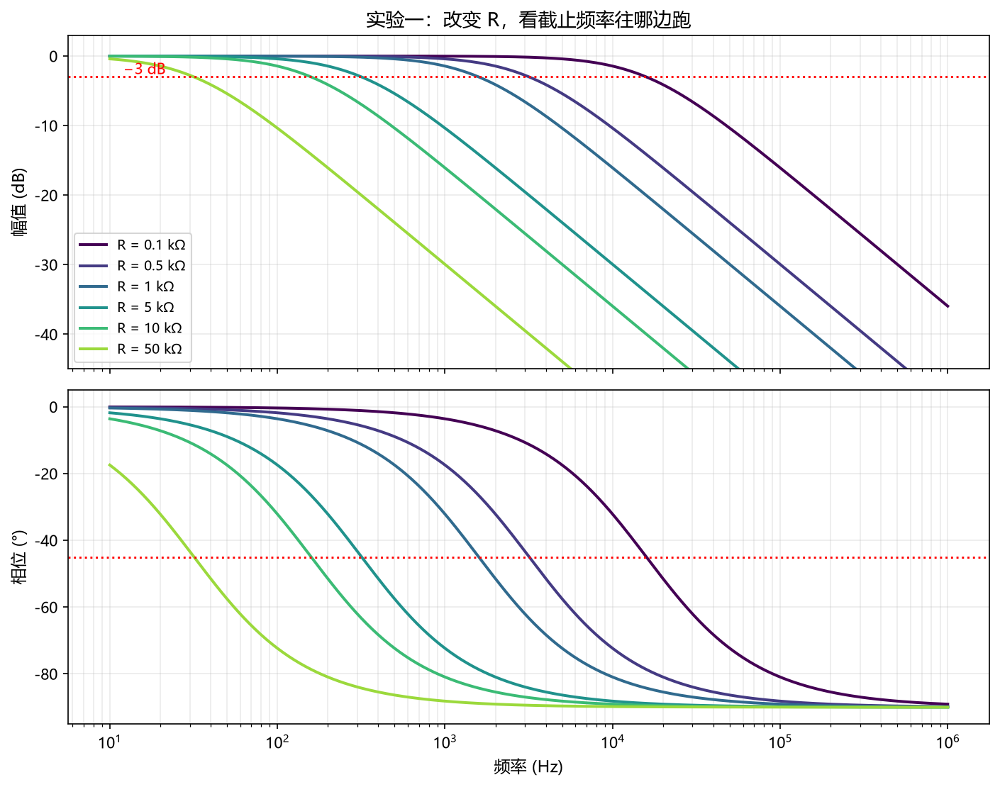
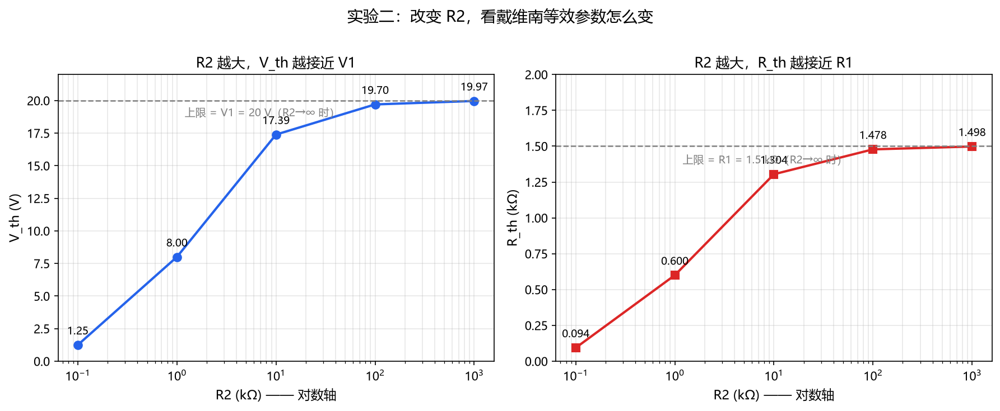
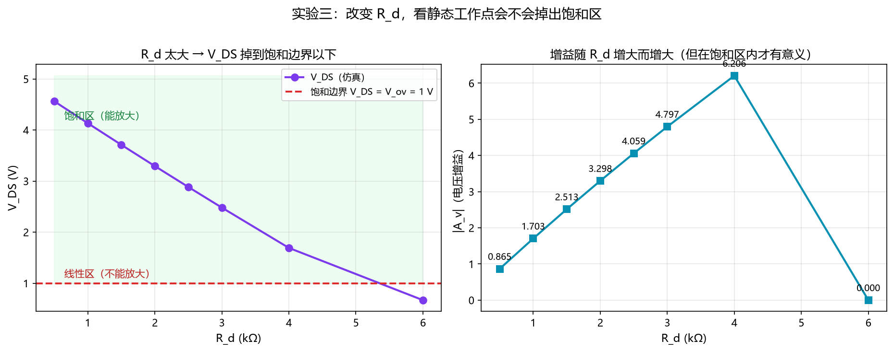

# 🧪 参数探索实验

> 用仿真的方式看「**参数一变，结果怎么变**」—— 这是动手理解电路最快的方法。
>
> ⚠️ 这个目录**完全独立**，不会改动作业脚本（`01/02/03_*.py`）。

---

## 怎么跑

```bash
cd experiments
python parameter_explorer.py
```

**输出两部分**：

1. 控制台打印**三张对比表**
2. `experiments/images/` 里生成**三张规律图**

---

## 实验一：RC 低通 —— 改变 R，看 τ 和 fc 怎么变

**固定**：C = 100 nF ｜ **变量**：R = 0.5k / 1k / 1.5k / 2k / 3k / 5k

| R (kΩ) | τ = RC (μs) | fc 理论 (Hz) | fc 仿真 (Hz) | 误差 |
| --- | --- | --- | --- | --- |
| 0.5 | 50.0 | 3183.1 | 3162.3 | 0.65 % |
| 1.0 | 100.0 | 1591.5 | 1584.9 | 0.42 % |
| 1.5 | 150.0 | 1061.0 | 1039.1 | 2.07 % |
| 2.0 | 200.0 | 795.8 | 794.3 | 0.18 % |
| 3.0 | 300.0 | 530.5 | 520.8 | 1.83 % |
| 5.0 | 500.0 | 318.3 | 316.2 | 0.65 % |



### 💡 规律

- **R 增大 → τ 变大 → fc 变小**（`fc = 1/(2πτ)`，反比关系）
- R 每翻一倍，τ 也翻一倍，**fc 就减半**
- **每条曲线的形状完全一样，只是整体左右平移** ← 这是最值得记住的一点
- 高频段斜率**永远是 −20 dB/十倍频**，跟 R 取多少无关
- 相位曲线在各自的 fc 处都过 −45°

> **换句话说**：R 和 C 只决定「转折点在哪」，不决定「转折得多陡」。陡峭程度由**滤波器的阶数**决定（一阶永远是 −20 dB/dec）。

---

## 实验二：戴维南定理 —— 改变 R2，看等效电源怎么变

**固定**：V1 = 20 V，R1 = 1.5 kΩ ｜ **变量**：R2 = 1k / 2k / 3k / 5k / 10k / 20k

| R2 (kΩ) | V_th (V) | R_th (kΩ) | I_sc (mA) | 仿真 V_oc (V) | 误差 |
| --- | --- | --- | --- | --- | --- |
| 1.0 | 8.0000 | 0.6000 | 13.3333 | 8.0000 | 0.000 % |
| 2.0 | 11.4286 | 0.8571 | 13.3333 | 11.4286 | 0.000 % |
| 3.0 | **13.3333** | **1.0000** | **13.3333** | 13.3333 | 0.000 % |
| 5.0 | 15.3846 | 1.1538 | 13.3333 | 15.3846 | 0.000 % |
| 10.0 | 17.3913 | 1.3043 | 13.3333 | 17.3913 | 0.000 % |
| 20.0 | 18.6047 | 1.3953 | 13.3333 | 18.6046 | 0.000 % |

> 加粗的 **3.0 kΩ** 就是作业②用的参数。



### 💡 规律

- **R2 增大 → V_th 增大**，最终趋近 V1 = 20 V（但永远到不了）
- **R2 增大 → R_th 增大**，最终趋近 R1 = 1.5 kΩ
- 两条曲线都是「**减速上升**」（饱和型曲线），不是直线
- **关键发现**：`I_sc` 居然**一直是 13.3333 mA 不变**！

### 🤔 为什么 I_sc 不变？

因为 `I_sc = V_th / R_th`，而这两个量的变化**正好互相抵消**：

```
V_th = V1·R2/(R1+R2)
R_th = R1·R2/(R1+R2)

I_sc = V_th/R_th = [V1·R2/(R1+R2)] / [R1·R2/(R1+R2)] = V1/R1
```

**R2 被约掉了** —— 所以 `I_sc = V1/R1 = 20/1.5k = 13.3333 mA`，**和 R2 一点关系都没有**。

> 这个规律光看公式不一定注意到，**跑一遍仿真就一目了然了**。

---

## 实验三：NMOS 共源 —— 改变 R_d，看工作点会不会掉出饱和区

**固定**：V_DD = 5 V，Rg1 = 60 kΩ，Rg2 = 40 kΩ，K = 0.8 mA/V²，V_th = 1 V，λ = 0.02 /V
**变量**：R_d = 0.5k / 1k / 1.5k / **2k** / 2.5k / 3k / 4k / 6k

| R_d (kΩ) | I_D (mA) | V_DS (V) | 工作区 | g_m (mA/V) | \|A_v\| |
| --- | --- | --- | --- | --- | --- |
| 0.5 | 0.4382 | 4.7809 | 饱和区 | 0.8765 | 0.436 |
| 1.0 | 0.4365 | 4.5635 | 饱和区 | 0.8730 | 0.865 |
| 1.5 | 0.4348 | 4.3478 | 饱和区 | 0.8696 | 1.288 |
| **2.0** | **0.4331** | **4.1339** | **饱和区** | **0.8661** | **1.703** |
| 2.5 | 0.4314 | 3.9216 | 饱和区 | 0.8627 | 2.111 |
| 3.0 | 0.4297 | 3.7109 | 饱和区 | 0.8594 | 2.513 |
| 4.0 | 0.4264 | 3.2946 | 饱和区 | 0.8527 | 3.298 |
| 6.0 | 0.4198 | 2.4809 | 饱和区 | 0.8397 | 4.797 |

> 加粗的 **2.0 kΩ** 就是作业③用的参数，这一行和作业结果**完全一致**。



### 💡 规律

**① V_DS 随 R_d 单调下降**

R_d 越大，它上面的压降越大，剩下的 V_DS 就越小。

**② 有一个「临界 R_d」**

当 V_DS 跌到 `V_ov = V_GS − V_th = 1 V` 以下时，管子就从**饱和区**掉进**线性区**，不再是放大器了。

本实验的参数下，临界值约 **9.8 kΩ**：（超出这个值就废了）

**③ 增益随 R_d 增大而增大**

在饱和区内 `|A_v| ≈ g_m·(R_d ∥ r_o)`，R_d 越大增益越高 —— 从 0.5 kΩ 时的 0.436 涨到 6 kΩ 时的 4.797，**涨了 11 倍**。

**④ 这就是「工作点设计」要权衡的地方**

```
想要高增益  →  加大 R_d
                ↓
        但 R_d 上的压降变大
                ↓
        V_DS 变小，余量被压缩
                ↓
        超过临界值 → 掉出饱和区 → 不能放大了
```

**⑤ 顺带一个细节**

I_D 和 g_m 都随着 R_d 增大而**略微减小**（0.4382 → 0.4198 mA）。

**原因**：λ 效应 —— R_d 变大后 V_DS 变小，沟道长度调制让电流略微减小。

> 如果不考虑 λ，I_D 会是个恒定值（0.4 mA）。这个细微变化正好体现了**仿真比手算更接近真实器件**。

---

## 🎯 三个实验的共同收获

| 实验 | 最值得记住的一句话 |
| --- | --- |
| 一 | R 和 C 只决定**转折点位置**，不决定**转折陡峭程度** |
| 二 | `I_sc = V1/R1`，**和 R2 无关**（R2 被约掉了）—— 跑仿真才发现 |
| 三 | 参数不能只盯着「指标好」，还要留**工作余量**，否则电路会失效 |

---

## ✏️ 想试别的参数？

打开 `parameter_explorer.py`，改这三个列表里的数字，重新运行即可：

```python
R_LIST  = [0.5, 1, 1.5, 2, 3, 5]      # 实验一的 R 值（kΩ）
R2_LIST = [1, 2, 3, 5, 10, 20]        # 实验二的 R2 值（kΩ）
RD_LIST = [0.5, 1, 1.5, 2, 2.5, 3, 4, 6]   # 实验三的 R_d 值（kΩ）
```

**几个可以试试的方向**：

| 想验证什么 | 怎么改 |
| --- | --- |
| R_d 超过临界值会怎样？ | 把 `RD_LIST` 加上 `8, 10, 12`，看 V_DS 是不是真的跌破 1 V |
| 提高 V_DD 能不能救回来？ | 把脚本里的 `VDD` 改成 `8`，再看临界 R_d 变成多少 |
| K 变大（管子更强）会怎样？ | 改 `K = 1.6e-3`，看增益和临界点怎么变 |
| 电容 C 换大会怎样？ | 改实验一的 `C_FAR`，看 fc 往哪边跑 |
| 去掉 λ 会怎样？ | 改 `LAM = 0`，看 I_D 是不是变成恒定的 0.4 mA |

---


---

## 🔬 对照实验：一次只改一个参数

> 脚本：`compare_parameters.py` ｜ 运行：`python compare_parameters.py`

### 为什么要做这个？

我第一次动手改参数时**同时改了三个**（V_DD、λ、R_d 列表），结果虽然跑出来了，但**说不清是哪一个在起作用** —— 这是做实验的大忌。

**教训**：**一次只改一个变量**，其他全部保持不动。

### 表 1：固定 R_d = 2 kΩ，分别改 V_DD 和 λ

| 情况 | V_DD | λ | V_G | V_ov | I_D (mA) | V_DS (V) | \|A_v\| |
| --- | --- | --- | --- | --- | --- | --- | --- |
| ① 原始 | 5 | 0.02 | 2.00 | 1.00 | 0.4331 | 4.1339 | 1.7028 |
| ② 只改 V_DD → 8 V | 8 | 0.02 | 3.20 | 2.20 | 2.0843 | 3.8313 | 3.4981 |
| ③ 只改 λ → 0 | 5 | 0 | 2.00 | 1.00 | 0.4000 | 4.2000 | 1.6000 |
| ④ 两个都改 | 8 | 0 | 3.20 | 2.20 | 1.9360 | 4.1280 | 3.5200 |

**怎么读这张表**：

- **对比 ① 和 ②**：只有 V_DD 动了 → `V_G` 从 2.00 涨到 3.20。因为**分压比是固定的**，V_DD 涨 60%，V_G 也跟着涨 60%
- **对比 ① 和 ③**：只有 λ 动了 → `I_D` 从 0.4331 降到 **0.4000 mA**（正好是「忽略 λ」的理论值）；`|A_v|` 从 1.7028 降到 **1.6000**（因为 r_o → ∞，负载只剩 R_d，就是 `g_m·R_d`）

### 表 2：临界 R_d 对比 ⭐

| 情况 | V_ov | V_DD − V_ov（余量） | I_D @边界 | **临界 R_d** |
| --- | --- | --- | --- | --- |
| ① 原始（V_DD=5, λ=0.02） | 1.00 V | 4.00 V | 0.408 mA | **9.80 kΩ** |
| ② 只改 V_DD → 8 V | 2.20 V | 5.80 V | 2.021 mA | **2.87 kΩ** |
| ③ 只改 λ → 0 | 1.00 V | 4.00 V | 0.400 mA | **10.00 kΩ** |
| ④ 两个都改 | 2.20 V | 5.80 V | 1.936 mA | **3.00 kΩ** |

### 💡 反直觉发现：提高 V_DD，临界 R_d 反而变小了！

直觉上「电源电压高了，余量更大，应该更不容易掉出饱和区」，但仿真结果**正好相反**：

```
V_DD:        5 V  →  8 V        （提高 60 %）
可用余量:   4.00 V → 5.80 V      （提高 45 %）
I_D:      0.408 mA → 2.021 mA    （暴涨 395 % ！）
                                    ↓
临界 R_d:  9.80 kΩ → 2.87 kΩ     （缩小到约 1/3）
```

**为什么电流涨得那么猛？**

因为**分压比是固定的**（Rg1 = 60 k、Rg2 = 40 k 没变）：

```
V_G = V_DD × Rg2/(Rg1+Rg2) = V_DD × 0.4
```

V_DD 从 5 涨到 8 → **V_G 也从 2.0 涨到 3.2** → 于是：

```
V_ov = V_G − V_th =  2.0 − 1 = 1.0 V   →   3.2 − 1 = 2.2 V    （翻了一倍多）
I_D ∝ V_ov²        =  1.0² = 1         →   2.2² = 4.84          （4.84 倍）
```

**电流按 V_ov 的平方增长，而余量只是线性增长** —— 结果临界 R_d 被暴涨的电流「吃掉」了。

> 这个结论光看公式很难一眼看出来，**跑一遍对照实验就非常清楚**。

### ⚠️ 顺带踩的一个坑

把 `λ` 改成 `0` 后，脚本崩了：

```
ZeroDivisionError: division by zero
```

原因是 `r_o = 1/(λ·I_D)`，λ=0 就除零了。

**物理上**：λ=0 表示没有沟道长度调制，管子是**理想恒流源**，此时 `r_o → ∞`。

**代码上**：得单独处理这种情况 —— 脚本里已经补上了：

```python
if LAM > 0:
    ro = 1 / (LAM * id_sim)
    av = gm * (rd * ro) / (rd + ro)
else:
    ro = float('inf')
    av = gm * rd          # r_o 无穷大时，负载只剩 R_d
```

> **这也说明**：改参数不只是改数字，**有些参数取极端值会让公式失效**，需要单独考虑。

### 📌 正确的改参数姿势

| ❌ 不要 | ✅ 要 |
| --- | --- |
| 一次改好几个参数 | **一次只改一个** |
| 改完凭感觉说「好像变了」 | 和基准情况**逐行对比** |
| 只看结论那一行 | 看**整张表**的变化趋势 |

---


---

## 🔍 深入：λ（沟道长度调制）变大到底影响了什么？

> 脚本：`lambda_comparison.py` ｜ 运行：`python lambda_comparison.py`

### 一个"自相矛盾"的现象

把 λ 从 0.02 改成 0.1，再看增益：

| R_d | λ = 0.02 | λ = 0.1 | 变化 |
| --- | --- | --- | --- |
| 0.5 kΩ | 0.4363 | 0.5714 | ⬆️ 升 |
| 2.0 kΩ | 1.7028 | 2.0000 | ⬆️ 升 |
| 6.0 kΩ | 4.7965 | 4.5000 | ⬇️ **降** |

**同一个参数改动，小 R_d 时增益升、大 R_d 时增益降** —— 看起来很矛盾。

### 原因：λ 对两个因子的影响方向相反

增益是**两个因子的乘积**：

```
|A_v| = g_m × (R_d ∥ r_o)
         ↑          ↑
      λ↑ 让它升    λ↑ 让它降
```

**λ 增大时会同时发生三件事**：

| 后果 | 公式依据 |
| --- | --- |
| ⬆ **I_D 变大** | `I_D = ½K·V_ov²(1 + λV_DS)`，λ 在括号里 |
| ⬆ **g_m 变大** | `g_m = 2I_D/V_ov`，I_D 大了，g_m 跟着大 |
| ⬇ **r_o 变小** | `r_o = 1/(λ·I_D)`，λ 在**分母**上 |

前两个让增益**上升**，第三个让增益**下降** —— 谁占上风，取决于 **R_d 和 r_o 谁大**。

### 用数据看这个竞争

**λ 从 0.02 → 0.5 时：**

| 情况 | g_m 变化 | R_d∥r_o 变化 | 净效果 |
| --- | --- | --- | --- |
| **R_d = 0.5 kΩ** | **+190 %** ⬆ | −24 % ⬇ | **+121 %** ⬆ |
| **R_d = 6 kΩ** | +52 % ⬆ | **−64 %** ⬇ | **−45 %** ⬇ |

### 为什么 r_o 在两种情况下影响力差这么多？

**R_d 小时**（0.5 kΩ，而 r_o = 114 kΩ）：

```
R_d ∥ r_o = (0.5 × 114)/(0.5 + 114) = 0.498 kΩ  ≈ 就是 R_d 本身
```

r_o 怎么变**几乎不影响**并联值 → **g_m 增大占主导** → 增益升。

**R_d 大时**（6 kΩ，而 λ=0.5 时 r_o 只有 3.1 kΩ）：

```
R_d ∥ r_o = (6 × 3.1)/(6 + 3.1) = 2.06 kΩ   ← 远小于 R_d！
```

r_o 变小时**把并联值拉得很低** → **r_o 减小占主导** → 增益降。

### 三档完整对比

**λ = 0.02**

| R_d (kΩ) | I_D (mA) | V_DS (V) | g_m (mA/V) | r_o (kΩ) | R_d∥r_o (kΩ) | \|A_v\| |
| --- | --- | --- | --- | --- | --- | --- |
| 0.5 | 0.4382 | 4.7809 | 0.8765 | 114.1 | 0.498 | 0.4363 |
| 1.0 | 0.4365 | 4.5635 | 0.8730 | 114.5 | 0.991 | 0.8655 |
| 2.0 | 0.4331 | 4.1339 | 0.8661 | 115.5 | 1.966 | 1.7028 |
| 4.0 | 0.4264 | 3.2946 | 0.8527 | 117.3 | 3.868 | 3.2984 |
| 6.0 | 0.4198 | 2.4809 | 0.8397 | 119.1 | 5.712 | 4.7965 |

**λ = 0.1**

| R_d (kΩ) | I_D (mA) | V_DS (V) | g_m (mA/V) | r_o (kΩ) | R_d∥r_o (kΩ) | \|A_v\| |
| --- | --- | --- | --- | --- | --- | --- |
| 0.5 | 0.5882 | 4.7059 | 1.1765 | 17.0 | 0.486 | 0.5714 |
| 1.0 | 0.5769 | 4.4231 | 1.1538 | 17.3 | 0.945 | 1.0909 |
| 2.0 | 0.5556 | 3.8889 | 1.1111 | 18.0 | 1.800 | 2.0000 |
| 4.0 | 0.5172 | 2.9310 | 1.0345 | 19.3 | 3.314 | 3.4286 |
| 6.0 | 0.4839 | 2.0968 | 0.9677 | 20.7 | 4.650 | 4.5000 |

**λ = 0.5**（极端情况）

| R_d (kΩ) | I_D (mA) | V_DS (V) | g_m (mA/V) | r_o (kΩ) | R_d∥r_o (kΩ) | \|A_v\| |
| --- | --- | --- | --- | --- | --- | --- |
| 0.5 | 1.2727 | 4.3636 | 2.5455 | 1.6 | 0.379 | 0.9655 |
| 1.0 | 1.1667 | 3.8333 | 2.3333 | 1.7 | 0.632 | 1.4737 |
| 2.0 | 1.0000 | 3.0000 | 2.0000 | 2.0 | 1.000 | 2.0000 |
| 4.0 | 0.7778 | 1.8889 | 1.5556 | 2.6 | 1.565 | 2.4348 |
| 6.0 | 0.6364 | 1.1818 | 1.2727 | 3.1 | 2.062 | 2.6250 |

**增益随 λ 的变化趋势**

| R_d (kΩ) | λ=0.02 | λ=0.1 | λ=0.5 | 趋势 |
| --- | --- | --- | --- | --- |
| 0.5 | 0.4363 | 0.5714 | 0.9655 | ⬆️ 升 |
| 1.0 | 0.8655 | 1.0909 | 1.4737 | ⬆️ 升 |
| 2.0 | 1.7028 | 2.0000 | 2.0000 | ⬆️ 升 |
| 4.0 | 3.2984 | 3.4286 | 2.4348 | ⬇️ 降 |
| 6.0 | 4.7965 | 4.5000 | 2.6250 | ⬇️ 降 |

### 💡 这解释了「为什么提高增益不能只靠加大 R_d」

理想情况下 `A_v = −g_m·R_d`，R_d 越大增益越高，**似乎没有上限**。

**但只要 λ ≠ 0**，r_o 就和 R_d 并联，**给增益设了一个天花板**：

```
R_d → ∞ 时，|A_v| → g_m·r_o        ← 这叫「本征增益」
```

**λ 越大，天花板越低**：

| λ | r_o | 本征增益 g_m·r_o |
| --- | --- | --- |
| 0.02 | ≈ 115 kΩ | ≈ **100 倍** |
| 0.1 | ≈ 18 kΩ | ≈ **20 倍** |
| 0.5 | ≈ 1.6 kΩ | ≈ **4 倍** |

**所以想提高增益，光加大 R_d 有极限** —— 更根本的办法是**减小 λ**：

- 在 IC 设计里就是**加长沟道 L**（λ ∝ 1/L）
- 或者用**共源共栅（cascode）结构**

> 这个「本征增益」的概念，是模拟 IC 设计里非常核心的一个指标。

---


---

## 📐 深入：仿真误差是怎么来的？（网格离散化）

> 脚本：`grid_analysis.py` ｜ 运行：`python grid_analysis.py`

### 现象：误差是两个固定值在交替

把 RC 的 R 范围扩大到 500 倍后，误差列出现了**奇怪的规律**：

| R (kΩ) | τ (μs) | fc 理论 (Hz) | fc 仿真 (Hz) | 误差 |
| --- | --- | --- | --- | --- |
| 0.1 | 10.0 | 15915.5 | 15848.9 | **0.42 %** |
| 0.5 | 50.0 | 3183.1 | 3162.3 | **0.65 %** |
| 1.0 | 100.0 | 1591.5 | 1584.9 | **0.42 %** |
| 5.0 | 500.0 | 318.3 | 316.2 | **0.65 %** |
| 10.0 | 1000.0 | 159.2 | 158.5 | **0.42 %** |
| 50.0 | 5000.0 | 31.8 | 31.6 | **0.65 %** |

**注意**：误差**不是**在两头变大，而是 **0.42 % 和 0.65 % 交替**。

### 原因：扫频是「离散网格」，不是连续曲线

脚本里的扫频设置：

```
频率范围：10 Hz ~ 1 MHz
密度    ：每十倍频 60 个点
→ 相邻点频率比 = 10^(1/60) = 1.039122，即相差 3.912%
→ 最大可能误差 = 1.937%（真实 fc 正好落在两点正中间时）
```

**仿真找「−3 dB 点」的方法**是：在扫频数据里找**增益最接近 −3 dB 的那个采样点**。

**所以真实 fc 如果落在两个采样点之间，就会有误差。**

### 关键：误差只取决于「fc 落在网格的哪个位置」

| R (kΩ) | 真实 fc (Hz) | 网格位置 | 小数部分 | 最近网格点 (Hz) | 推算误差 | 实测误差 |
| --- | --- | --- | --- | --- | --- | --- |
| 0.1 | 15915.5 | 192.**11** | .11 | 15848.9 | 0.418 % | **0.42 %** |
| 0.5 | 3183.1 | 150.**17** | .17 | 3162.3 | 0.654 % | **0.65 %** |
| 1.0 | 1591.5 | 132.**11** | .11 | 1584.9 | 0.418 % | **0.42 %** |
| 5.0 | 318.3 | 90.**17** | .17 | 316.2 | 0.654 % | **0.65 %** |
| 10.0 | 159.2 | 72.**11** | .11 | 158.5 | 0.418 % | **0.42 %** |
| 50.0 | 31.8 | 30.**17** | .17 | 31.6 | 0.654 % | **0.65 %** |

**推算值和实测值完全吻合** —— 说明误差的来源就是这个。

### 为什么会有「两组完全相同的小数」？

因为 **0.1 / 1 / 10** 这三个值**正好相差 10 倍**：

```
在对数扫频网格上，10 倍 = 整数个十倍频程 = 整数个格子
→ 三者落在完全相同的「相对位置」上（小数部分都是 .11）
→ 误差自然完全相同
```

同理 **0.5 / 5 / 50** 是另一组（小数部分都是 .17）。

### 💡 结论

| 常见误解 | 实际情况 |
| --- | --- |
| 「R 太大或太小，所以误差大」 | ❌ 不是 |
| 「公式不够准」 | ❌ 不是 |
| 「扫频范围不够宽」 | ❌ 不是 |
| **误差只取决于 fc 落在扫频网格的哪个位置** | ✅ **这才是真相** |

**这属于「数值离散化误差」，不是物理误差。**

### 🔧 想减小误差怎么办？

**加密扫频点**。把 `number_of_points=60` 改成 `300`：

```
相邻点频率比：10^(1/300) = 1.00770  → 相差 0.770%
最大可能误差：0.385%（比原来的 1.937% 小 5 倍）
```

**代价**：计算量变成 5 倍，跑得慢一些。

> **这就是仿真中的通用权衡：点数越多越准，但算得越慢。**

### 📌 这个发现的实际意义

以后看到仿真结果有 **0.x % 的小误差**时，**先别急着怀疑公式或模型** —— 很可能只是：

- **扫频/扫描的点不够密**
- 或者 **fc 恰好落在两个采样点之间**

**判断方法**：把点数加密一倍再跑一次，如果误差明显变小 → **就是离散化误差**，不是模型问题。

---

## 📌 和作业的关系

这个目录是**课外探索**，作业的提交内容是：

| 作业提交物 | 位置 |
| --- | --- |
| 三个仿真脚本 | 仓库根目录 `01/02/03_*.py` |
| 报告 | `README.md` |
| 学习笔记 | `notes/` |

**`experiments/` 里的内容不属于作业要求**，是为了自己搞懂电路加的实验。

---

*实验脚本：`parameter_explorer.py`*
