# Logisim 数字电路实验记录

> 为「简易 CPU 搭建」作业做的前置练习 —— 先把数字电路的基础积木（逻辑门）画熟。
>
> 已完成：**实验一**（六种逻辑门）、**实验二**（译码器 / 编码器 / 数据选择器）、**实验三**（七段数码管译码器）
>
> 下一步：[加法器 / 比较器](#)（待完成）→ [触发器 / 寄存器](#)（待完成）→ [**简易 CPU（sCPU）**](#)（待完成）

---

## 实验环境

| 项目 | 内容 |
| --- | --- |
| 软件 | **Logisim-evolution 4.0.0**（自带 Java 运行时）|
| 系统 | Windows 11（64 位）|
| 参考讲义 | [一生一芯 v26.07 · F2 Logisim 安装和使用](https://ysyx.oscc.cc/docs/2607/f/2.html)、[F3 数字逻辑电路基础](https://ysyx.oscc.cc/docs/2607/f/3.html) |

---

## 实验一：六种基本逻辑门

### 1. 实验目的

- 熟悉 Logisim 的基本操作（放置元件、连线、设置属性、仿真）
- 掌握六种基本逻辑门的功能与真值表
- 为后续搭建译码器、数据选择器和 CPU 打基础

### 2. 电路文件

| # | 文件 | 逻辑门 | 输入数 |
| --- | --- | --- | --- |
| 1 | [`and.circ`](and.circ) | AND（与门） | 2 |
| 2 | [`not.circ`](not.circ) | NOT（非门） | 1 |
| 3 | [`or.circ`](or.circ) | OR（或门） | 2 |
| 4 | [`nand.circ`](nand.circ) | NAND（与非门） | 2 |
| 5 | [`nor.circ`](nor.circ) | NOR（或非门） | 2 |
| 6 | [`xor.circ`](xor.circ) | XOR（异或门） | 2 |

**电路结构**（六个文件都采用同样的结构）：

```
输入 A ──┐
         ├──[ 逻辑门 ]── 输出
输入 B ──┘
```

> 非门只有一个输入：`输入 ──[ NOT ]── 输出`

### 3. 真值表

| A | B | AND | OR | NAND | NOR | XOR |
| :-: | :-: | :-: | :-: | :-: | :-: | :-: |
| 0 | 0 | 0 | 0 | **1** | **1** | 0 |
| 0 | 1 | 0 | 1 | 1 | 0 | **1** |
| 1 | 0 | 0 | 1 | 1 | 0 | **1** |
| 1 | 1 | **1** | 1 | **0** | 0 | 0 |

**非门**：

| A | NOT |
| :-: | :-: |
| 0 | **1** |
| 1 | **0** |

**记忆口诀**：

| 逻辑门 | 口诀 |
| --- | --- |
| AND | **全 1 才 1** |
| OR | **有 1 就 1** |
| NAND | 与门结果**取反**（只有 11 得 0）|
| NOR | 或门结果**取反**（只有 00 得 1）|
| XOR | **不同才 1**（相同得 0）|
| NOT | **取反** |

### 4. 仿真记录

<!-- 截图放这里，命名建议：images/01-and.png 等 -->

| # | 截图 | 说明 |
| --- | --- | --- |
| 1 | 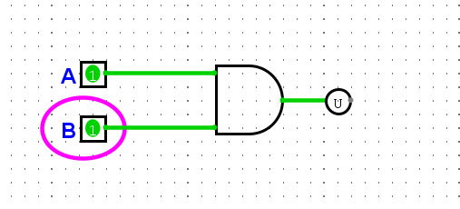 | A=1, B=1 → 输出 1 |
| 2 | 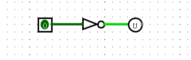 | 输入 0 → 输出 1 |
| 3 | 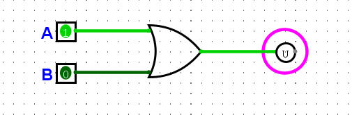 | A=0, B=1 → 输出 1 |
| 4 | 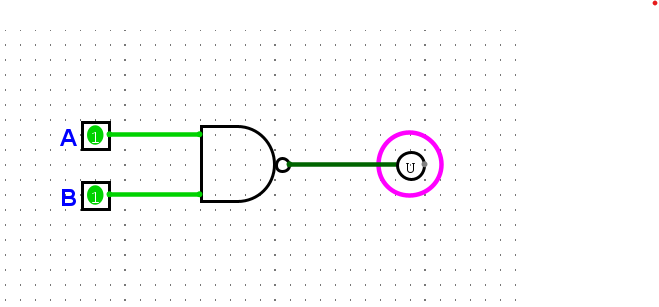 | A=1, B=1 → 输出 0 |
| 5 | 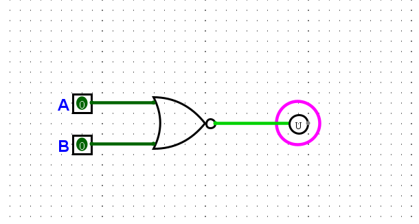 | A=0, B=0 → 输出 1 |
| 6 | 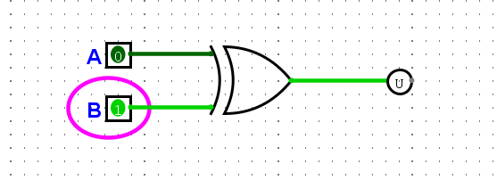 | A=1, B=0 → 输出 1 |

### 5. 仿真方法

```
① 打开对应的 .circ 文件
② 点击工具栏的【手形图标】进入仿真模式（鼠标变手形）
③ 点击输入引脚 A、B 切换 0 / 1
④ 观察输出引脚或探针的值
⑤ 对照真值表核对
```

**Logisim 中信号颜色的含义**：

| 颜色 | 含义 |
| --- | --- |
| 亮绿 | `1`（高电平）|
| 深绿 / 暗 | `0`（低电平）|
| **蓝色** | **高阻态（z）—— 这根线没有驱动源** |
| 红色 | 冲突（多个输出接到一起）|

---

## 实验二：译码器 / 编码器 / 数据选择器

> 这三个器件是**考核明确要求**的，也是 CPU 里最常用的组合逻辑模块。

### 1. 实验目的

- 掌握三种基本组合逻辑器件的功能与实现方法
- 理解它们之间的关系（**MUX = 译码器 + 与门 + 或门**）
- 为 sCPU 的**指令译码器**和**数据通路**做准备

### 2. 三者对比

| 器件 | 输入 → 输出 | 主要用什么门 | CPU 里用在哪 |
| --- | --- | --- | --- |
| **译码器** | n 位 → 2ⁿ 个输出（独热码）| 与门 + 非门 | **指令译码器**、地址译码器 |
| **编码器** | 2ⁿ 个输入 → n 位输出 | **或门** | 中断优先级、键盘编码 |
| **数据选择器** | 2ⁿ 路数据 + n 位选择 → 1 个输出 | 与门 + 或门 + 非门 | 选写回数据、选 PC 的下一个值 |

---

### 3. 2-4 译码器

📄 电路文件：[`decoder24.circ`](decoder24.circ)

**功能**：把 2 位二进制输入，转换成 4 个输出中**唯一一个为 1**（这就是「**独热码**」）。

**真值表**：

| A1 | A0 | Y3 | Y2 | Y1 | Y0 |
| :-: | :-: | :-: | :-: | :-: | :-: |
| 0 | 0 | 0 | 0 | 0 | **1** |
| 0 | 1 | 0 | 0 | **1** | 0 |
| 1 | 0 | 0 | **1** | 0 | 0 |
| 1 | 1 | **1** | 0 | 0 | 0 |

**逻辑式**（每个输出对应一种输入组合）：

```
Y0 = ¬A1 · ¬A0
Y1 = ¬A1 ·  A0
Y2 =  A1 · ¬A0
Y3 =  A1 ·  A0
```

**实现元件**：**2 个非门 + 4 个与门**

**仿真记录**：

| 截图 | 说明 |
| --- | --- |
| 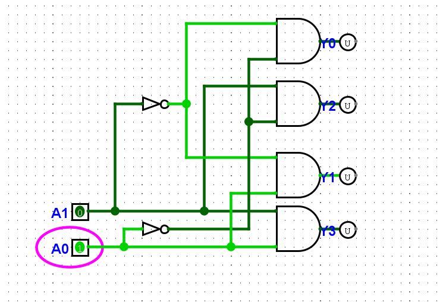 | A1A0 = 01 → **只有 Y1 为 1**（独热）|
| 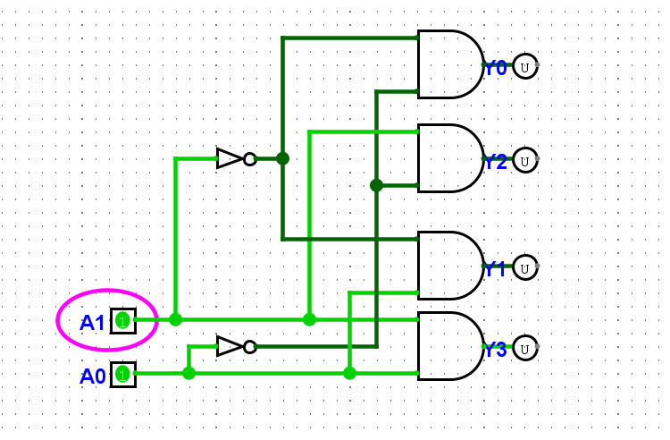 | A1A0 = 11 → **只有 Y3 为 1** |

> 💡 **关键观察**：**任何时刻只有 1 个输出是亮的** —— 这就是译码器的本质。

---

### 4. 4-2 编码器

📄 电路文件：[`encoder42.circ`](encoder42.circ)

**功能**：译码器的**逆操作** —— 4 个输入中**哪一个为 1**，就输出它的**编号**。

**真值表**：

| I3 | I2 | I1 | I0 | Y1 | Y0 | 编号 |
| :-: | :-: | :-: | :-: | :-: | :-: | :-: |
| 0 | 0 | 0 | **1** | 0 | 0 | 0 |
| 0 | 0 | **1** | 0 | 0 | 1 | 1 |
| 0 | **1** | 0 | 0 | 1 | 0 | 2 |
| **1** | 0 | 0 | 0 | 1 | 1 | 3 |

**逻辑式**（从真值表找规律）：

```
Y1 = I3 + I2        ← 看 Y1 何时为 1
Y0 = I3 + I1        ← 看 Y0 何时为 1
```

**实现元件**：**只需要 2 个或门**！（`I0` 不接任何门 —— 编号 0 是"默认状态"）

**仿真记录**：

| 截图 | 说明 |
| --- | --- |
| 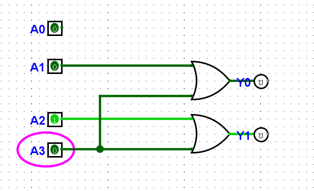 | I2=1 → Y1Y0 = **10**（编号 2）|
| 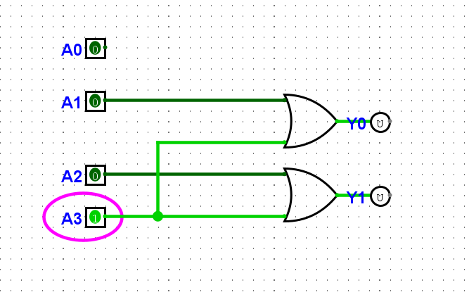 | I3=1 → Y1Y0 = **11**（编号 3）|

**⚠️ 这个编码器的局限**

它假设**同一时刻只有一个输入为 1**。如果多个输入同时为 1，输出就会出错。

**举例**：`I2` 和 `I1` 同时为 1

```
Y1 = I3 + I2 = 0 + 1 = 1
Y0 = I3 + I1 = 0 + 1 = 1
→ 输出 11 = 编号 3   ← 错！实际是两个键同时按
```

**真实电路用「优先编码器」**（如 **74LS148**）—— 给每个输入排**优先级**，多个同时有效时输出**编号最大**的那个。

---

### 5. 4 选 1 数据选择器（MUX）

📄 电路文件：[`mux41.circ`](mux41.circ)

**功能**：根据选择信号 `S1S0`，从 4 路数据中**选中一路**送到输出。

**真值表**：

| S1 | S0 | 输出 Y |
| :-: | :-: | --- |
| 0 | 0 | **D0** |
| 0 | 1 | **D1** |
| 1 | 0 | **D2** |
| 1 | 1 | **D3** |

**逻辑式**：

```
Y = ¬S1·¬S0·D0  +  ¬S1·S0·D1  +  S1·¬S0·D2  +  S1·S0·D3
    └────┬────┘     └────┬────┘     └────┬────┘     └────┬────┘
     S1S0=00          S1S0=01          S1S0=10          S1S0=11
```

**实现元件**：

| 元件 | 数量 | ⚠️ 关键设置 |
| --- | --- | --- |
| NOT Gate | 2 | 产生 ¬S1、¬S0 |
| **AND Gate** | 4 | **`Number of Inputs` 要改成 3** |
| **OR Gate** | 1 | **`Number of Inputs` 要改成 4** |

**每个与门的接法**：

| 与门 | 输入 1 | 输入 2 | 输入 3 |
| --- | --- | --- | --- |
| AND0 | ¬S1 | ¬S0 | **D0** |
| AND1 | ¬S1 | S0 | **D1** |
| AND2 | S1 | ¬S0 | **D2** |
| AND3 | S1 | S0 | **D3** |

**仿真记录**：

| 截图 | 说明 |
| --- | --- |
| 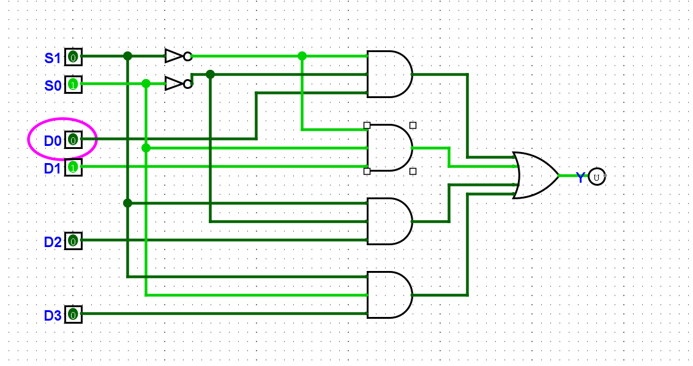 | S1S0 = 00，D0 = 1 → **Y = 1**（选中 D0）|

---

### 6. 💡 三者之间的关系（核心理解）

```
译码器：   n 位  ──────→  2ⁿ 个输出（独热码）
编码器：   2ⁿ 个输入  ──→  n 位输出
MUX：      2ⁿ 路数据 + n 位选择  ──→  1 个输出
                              ↑
                     选择信号 = 译码器的输出
```

**一句话总结**：

> **MUX = 译码器 + 与门 + 或门**
>
> | 部件 | 作用 |
> | --- | --- |
> | **译码器** | 决定「**选哪一路**」（输出独热码）|
> | **与门** | 把没选中的路「**关掉**」（输出 0）|
> | **或门** | 把选中的那一路「**放行**」出去 |

**对照验证**：4 选 1 MUX 的 4 个与门，它们的「选择信号输入」正好就是 **2-4 译码器的 4 个输出** —— 说明两者是同一套思路。

---

### 7. 实验结论

1. **译码器用与门，编码器用或门** —— 一个漂亮的对称：
   - **译码器**要求**所有条件同时满足**（与）
   - **编码器**只要**任一条件满足**即可（或）

2. **MUX 本质上是「译码器 + 数据门控」** —— 理解了译码器，MUX 就水到渠成。

3. **门的输入数量可以修改** —— 通过属性栏的 **`Number of Inputs`**，2 输入与门可以变成 3 输入、4 输入。

4. **两个重要的排错信号**：
   - **红线** = 冲突（多个输出接到了同一条线上）
   - **蓝线** = 高阻（这条线没有任何驱动源）

   > 搭 sCPU 时，**这两种颜色是最快的排错入口**。

5. **验证方法**：**文件坐标只能"推测"电路逻辑，真正的判据永远是仿真结果** —— 这次分析中就出现过「按坐标推断错误、但仿真实际正确」的情况。

---

## 实验三：七段数码管译码器

> 译码器的**实战应用** —— 把 4 位二进制数字变成数码管的 7 段显示。

📄 电路文件：`seg7_rom.circ`

### 1. 实验目的

- 把「译码器」的概念用到实际显示器件上
- 掌握**七段数码管**的段码编码
- 学习**用 ROM 查表**实现复杂组合逻辑（真实芯片的常见做法）

### 2. 七段数码管的结构

```
      a
    ┌─────┐
  f │     │ b
    ├──g──┤
  e │     │ c
    └─────┘
      d
```

**7 段**：`a b c d e f g`

| 类型 | 特点 | Logisim 设置 |
| --- | --- | --- |
| **共阴极** | 输入 `1` = 点亮 | 勾选 `Common Cathode` |
| 共阳极 | 输入 `0` = 点亮 | 不勾选 |

**本实验用共阴极**（1 = 亮，符合直觉）。

### 3. 真值表与段码

| 数字 | D3 D2 D1 D0 | a | b | c | d | e | f | g | **段码**（abcdefg）| 十六进制 |
| :-: | :-: | :-: | :-: | :-: | :-: | :-: | :-: | :-: | :-: | :-: |
| 0 | 0000 | 1 | 1 | 1 | 1 | 1 | 1 | 0 | 1111110 | **7E** |
| 1 | 0001 | 0 | 1 | 1 | 0 | 0 | 0 | 0 | 0110000 | **30** |
| 2 | 0010 | 1 | 1 | 0 | 1 | 1 | 0 | 1 | 1101101 | **6D** |
| 3 | 0011 | 1 | 1 | 1 | 1 | 0 | 0 | 1 | 1111001 | **79** |
| 4 | 0100 | 0 | 1 | 1 | 0 | 0 | 1 | 1 | 0110011 | **33** |
| 5 | 0101 | 1 | 0 | 1 | 1 | 0 | 1 | 1 | 1011011 | **5B** |
| 6 | 0110 | 1 | 0 | 1 | 1 | 1 | 1 | 1 | 1011111 | **5F** |
| 7 | 0111 | 1 | 1 | 1 | 0 | 0 | 0 | 0 | 1110000 | **70** |
| 8 | 1000 | 1 | 1 | 1 | 1 | 1 | 1 | 1 | 1111111 | **7F** |
| 9 | 1001 | 1 | 1 | 1 | 1 | 0 | 1 | 1 | 1111011 | **7B** |
| 10~15 | — | 0 | 0 | 0 | 0 | 0 | 0 | 0 | 0000000 | **00** |

**记忆技巧**：

| 数字 | 特点 |
| --- | --- |
| **0** | 除 `g` 外全亮 |
| **1** | 只有 `b`、`c` |
| **7** | 只有 `a`、`b`、`c`（比 1 多个 `a`）|
| **8** | **全亮** |

### 4. 两种实现方案

#### 方案 A：用逻辑门直接实现

设 `A=D3, B=D2, C=D1, D=D0`，用卡诺图化简得：

```
a = A + C + B·D + ¬B·¬D
b = ¬B + ¬C·¬D + C·D
c = ¬C + D + B
d = A + ¬B·¬C + B·¬C·¬D + ¬B·C·D
e = ¬B·¬D + C·¬D
f = A + C·¬D + B·¬D + B·¬C
g = A + B·¬C + ¬B·C + C·¬D
```

**元件需求**：4 个非门 + **约 20 个与门/或门**

**缺点**：门太多，连线复杂，容易出错。

#### ⭐ 方案 B：用 ROM 查表（本实验采用）

**思路**：**把真值表直接"烧"进 ROM** —— 4 位地址进，7 位段码出。

```
4 位输入  ──→  ROM 地址
                  ↓
              7 位段码
                  ↓
             Splitter 拆成 7 路
                  ↓
              数码管 a~g
```

**ROM 设置**：

| 属性 | 值 |
| --- | --- |
| `Address Bit Width` | **4** |
| `Data Bit Width` | **7** |
| `Contents` | `7E 30 6D 79 33 5B 5F 70 7F 7B 00 00 00 00 00 00` |

**Splitter 设置**：

| 属性 | 值 |
| --- | --- |
| `Input Bit Width` | **7** |
| `Fan Out` | **7** |

**优点**：

| 优点 | 说明 |
| --- | --- |
| **一个元件搞定** | 不用画 20 多个门 |
| **真实电路就这么做** | 数码管驱动芯片本质就是查表 |
| **易修改** | 想显示字母（A~F）只要改表格 |
| **逻辑清晰** | 「输入地址 → 输出数据」，一眼看懂 |

### 5. 仿真记录

| 截图 | 说明 |
| --- | --- |
| 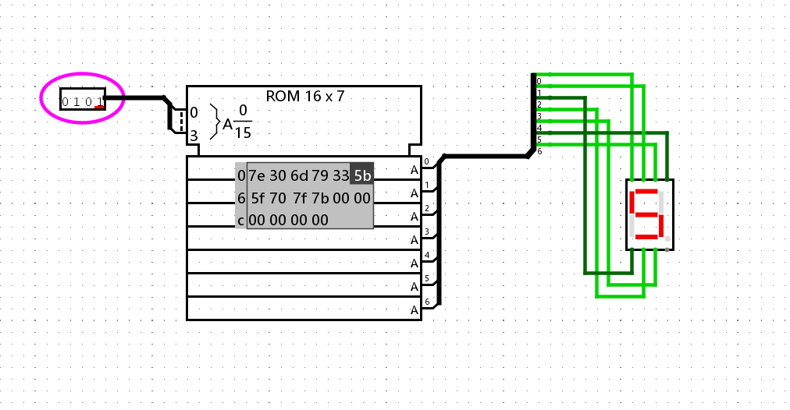 | 输入 `0101`（=5）→ 数码管显示 **「5」** |
| 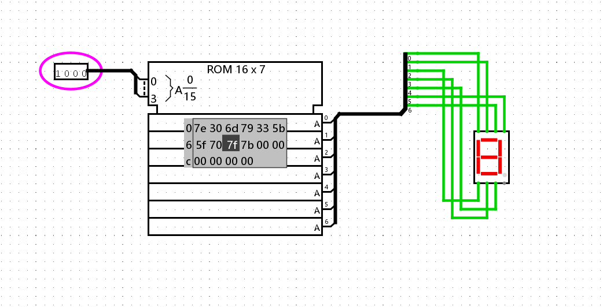 | 输入 `1000`（=8）→ 数码管显示 **「8」**（全亮）|

**截图里还能看到 ROM 的 Contents 表格**，可以直接核对段码是否正确。

### 6. ⭐ 调试记录：用「已知输入」反推接线错误

**现象**：电路搭好后，输入 `4` 但数码管显示的不是「4」。

**排查过程**：

**第一步：先确认所有线都接上了**

```
输入 8 → 段码是 1111111，应该 7 段全亮
结果：全亮 ✅ → 说明 7 根线都通了，问题在「哪根接到哪一段」
```

**第二步：用已知输入反推映射**

| 输入 | 值为 1 的位 | 实际亮的段 |
| :-: | :-: | --- |
| 1 | bit5, bit4 | **d, e** |
| 4 | bit5, bit4, bit1, bit0 | **d, e, f, g** |
| 2 | bit6, bit5, bit3, bit2, bit0 | **a, b, c, d, g** |

**推理**：

```
输入1 → 只有 bit5、bit4 为 1 → 亮的 d、e 就是接在这两位上
输入4 → 又多出 f、g → 它们接的是 bit1、bit0
输入2 → 交叉验证：g 亮且 bit0 在集合里 → g 接 bit0，f 接 bit1
                      d 亮且 bit5 在集合里 → d 接 bit5，e 接 bit4
```

**得出的完整映射**：

| 数码管段 | 实际接的位 | 正确应该是 |
| --- | :-: | :-: |
| a | bit 6 | bit 6 ✅ |
| **b** | **bit 3** | **bit 5** ❌ |
| **c** | **bit 2** | **bit 4** ❌ |
| **d** | **bit 5** | **bit 3** ❌ |
| **e** | **bit 4** | **bit 2** ❌ |
| f | bit 1 | bit 1 ✅ |
| g | bit 0 | bit 0 ✅ |

**结论**：**`b↔d` 两根线接反了，`c↔e` 两根线也接反了**。

**第三步：交换这两对线 → 全部数字显示正确** ✅

**经验总结**：

> **这是一个很实用的调试方法** —— 当"输出整体不对但都有反应"时，
> **用几个「只有少数几位为 1」的输入**，就能**反推出每一位实际接到了哪里**，
> 而不需要一根根线去查。

### 7. 实验结论

1. **ROM 查表是实现复杂组合逻辑的利器** —— 20 多个门才能实现的译码，一个 ROM 就搞定了。
2. **实际芯片也这么干** —— 数码管驱动、字符显示、微码控制，本质都是「地址 → 数据」的查表。
3. **七段数码管是"译码器"最直观的应用** —— 输入一个编号，输出"点亮哪几盏灯"。
4. **调试方法比调试结果更重要** —— 这次用「已知输入反推接线」的思路，可以推广到后面搭 CPU 时的排错。

---

## 遇到的问题与解决

### 问题 1：连线没有真正连到元件引脚上

**现象**：进入仿真模式后，点击输入引脚，输出**毫无反应**；或者线显示为**蓝色**。

**原因**：线的端点**没有精确落在元件的引脚**上（差了几个像素），Logisim 视为**未连接**。

**判断方法**：在编辑模式下**拖动元件**，观察线是否跟着移动 ——
- 跟着动 = 已连接 ✅
- 不动 = 未连接 ❌

**解决**：拖动线的端点，**看到绿色小圆点**（吸附提示）后再松手。

### 问题 2：`Ctrl + S` 覆盖了原文件

**现象**：在 `and.circ` 上画完非门，按 `Ctrl+S`，结果 `and.circ` 里装的是非门。

**原因**：`Ctrl + S` 是「**保存**」（覆盖当前文件），不是「**另存为**」。

**解决**：做新电路时，**先 `File → Save As...` 另存为新文件**，**再修改内容**。

| 操作 | 效果 |
| --- | --- |
| `Ctrl + S` | 保存（覆盖当前文件）|
| `File → Save As...` | 另存为（新建文件）|

---

## 实验结论

1. **六种基本逻辑门**都能在 Logisim 中正确实现并验证真值表。
2. **异或门（XOR）值得特别注意** —— 它的"不同才 1"特性正是**加法器**的核心（`1+1=0 进 1`），后续做加法器时会用到。
3. **连线必须精确连到引脚上** —— 这是数字电路仿真中最容易犯的错误，用"拖动元件看线是否跟随"可以快速判断。
4. **模块化习惯**：每种门单独存一个文件，清晰、便于验证、便于复用。

---

## 下一步计划

| 阶段 | 内容 | 状态 |
| --- | --- | --- |
| 实验一 | 六种基本逻辑门 | ✅ 完成 |
| 实验二 | 译码器、编码器、数据选择器 | ✅ **完成** |
| 实验三 | 七段数码管译码器（ROM 查表）| ✅ **完成** |
| 实验四 | 加法器、比较器 | ⏳ 待做 |
| 实验四 | 触发器、寄存器、计数器 | ⏳ 待做 |
| **正式作业** | **简易 CPU（sCPU）—— ysyx F5** | ⏳ 待做 |
| 加分项 | 输入输出（ysyx F6）| ⏳ 待做 |

---

*实验日期：2026 年 10 月*
